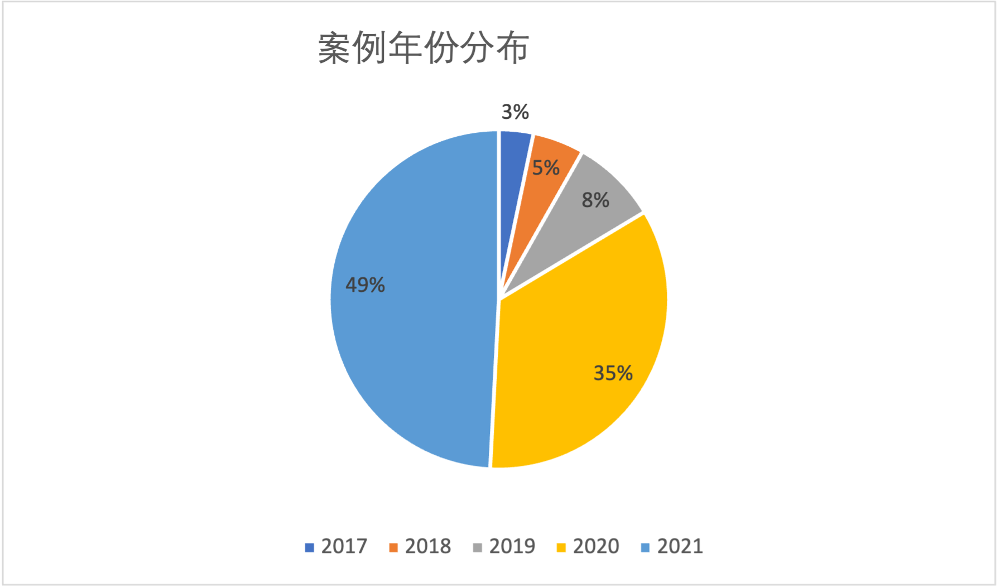
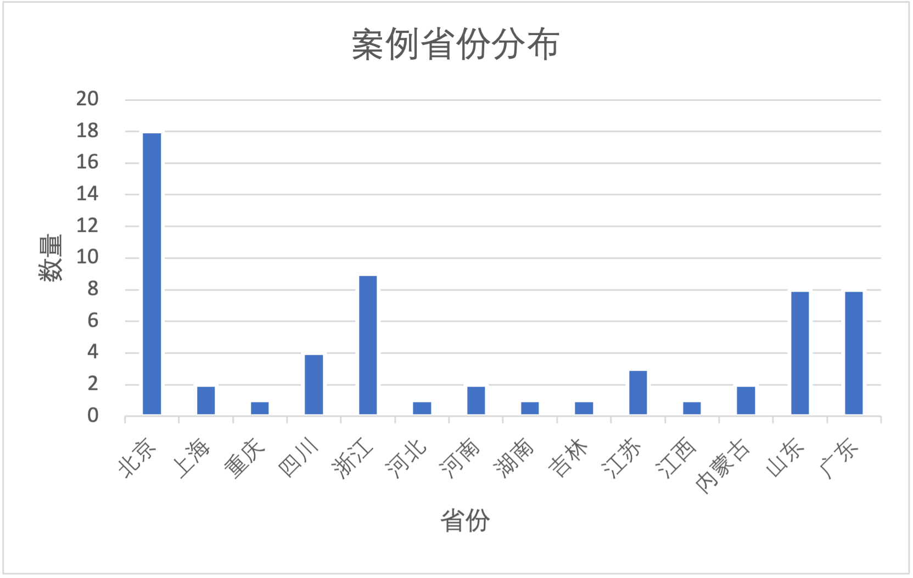
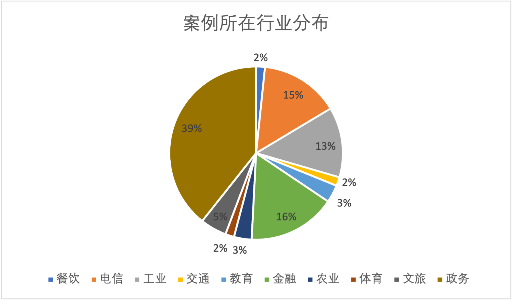
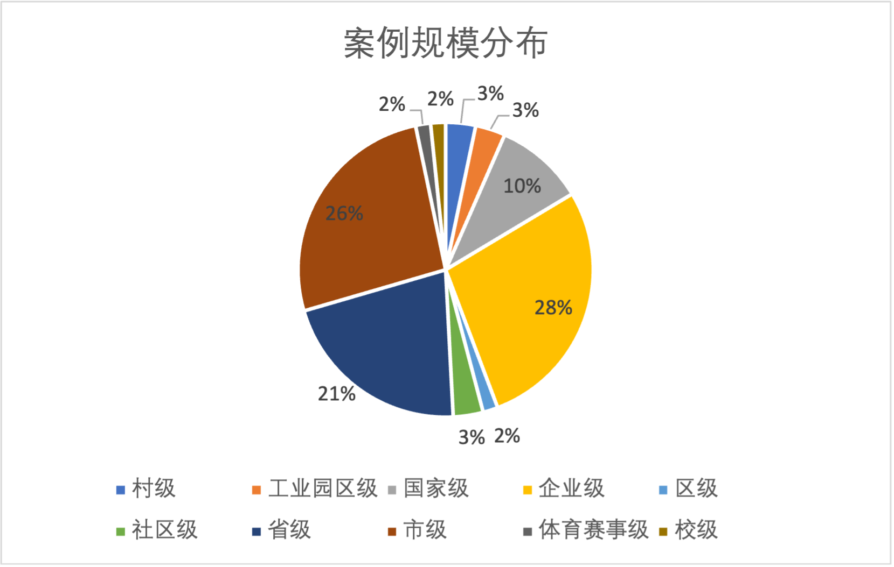

* [1 物联网案例统计](#1-物联网案例统计)
* [2 案例统计](#2-案例统计)
* [3 案例介绍](#3-案例介绍)
    * [3.1 大数据海关案例](#31-大数据海关案例)
    * [3.2 城市大脑案例](#32-城市大脑案例)
    * [3.3 水电机组智慧运维案例](#33-水电机组智慧运维案例)
    * [3.4 精准防疫案例](#34-精准防疫案例)
    * [3.5 某智能园区案例](#35-某智能园区案例)
    * [3.6 面向隐私保护计算的政务服务数据中台案例](#36-面向隐私保护计算的政务服务数据中台案例)
    * [3.7 人工智能科研与教学平台案例](#37-人工智能科研与教学平台案例)
    * [3.8 司法拍卖案例](#38-司法拍卖案例)
    * [3.9 基于多方安全计算，探索金融行业数据融合应用案例](#39-基于多方安全计算探索金融行业数据融合应用案例)
    * [3.10 智慧足迹经济运行平台案例](#310-智慧足迹经济运行平台案例)
    * [3.11 智能风险防控案例](#311-智能风险防控案例)
    * [3.12 分布式内存数据库提升数据平台及业务系统效能案例](#312-分布式内存数据库提升数据平台及业务系统效能案例)
    * [3.13 云图云研平台案例](#313-云图云研平台案例)
    * [3.14 智慧果园案例](#314-智慧果园案例)
    * [3.15 某数字化车间案例](#315-某数字化车间案例)
    * [3.16 大数据应急救灾案例](#316-大数据应急救灾案例)
    * [3.17 自助式图分析案例](#317-自助式图分析案例)
    * [3.18 城市大脑应用管理平台案例](#318-城市大脑应用管理平台案例)
    * [3.19 社区服务大数据案例](#319-社区服务大数据案例)
    * [3.20 自动化数据挖掘案例](#320-自动化数据挖掘案例)
    * [3.21 信息城数字服务平台案例](#321-信息城数字服务平台案例)
    * [3.22 企业一站式人工智能中台案例](#322-企业一站式人工智能中台案例)
    * [3.23 经济犯罪追赃挽损平台案例](#323-经济犯罪追赃挽损平台案例)
    * [3.24 移动大数据在文旅运营监管中的应用研究与实践案例](#324-移动大数据在文旅运营监管中的应用研究与实践案例)
    * [3.25 商业银行数据湖案例](#325-商业银行数据湖案例)
    * [3.26 融合多源数据，建设市全域全息文旅数据中心案例](#326-融合多源数据建设市全域全息文旅数据中心案例)
    * [3.27 可信企业征信服务平台案例](#327-可信企业征信服务平台案例)
    * [3.28 基于“能源范式“的工业经济大脑预警案例](#328-基于能源范式的工业经济大脑预警案例)
    * [3.29 5G+移动大数据在应急领域的应用实践案例](#329-5g移动大数据在应急领域的应用实践案例)
    * [3.30 基于大数据的 5G 智慧商业运营平台案例](#330-基于大数据的-5g-智慧商业运营平台案例)
    * [3.31 代理人数字化智能运营平台案例](#331-代理人数字化智能运营平台案例)
    * [3.32 农村”三资“管理案例](#332-农村三资管理案例)
    * [3.33 推进上云用数赋智，加速网格高质量发展案例](#333-推进上云用数赋智加速网格高质量发展案例)
    * [3.34 银行企业级欺诈风控平台案例](#334-银行企业级欺诈风控平台案例)
    * [3.35 银行行为数据分析系统案例](#335-银行行为数据分析系统案例)
    * [3.36 经济监测运行平台案例](#336-经济监测运行平台案例)
    * [3.37 教育大数据管理体系建设及数据应用实践案例](#337-教育大数据管理体系建设及数据应用实践案例)
    * [3.38 大数据平台-深度分析云助力科学敏捷决策案例](#338-大数据平台-深度分析云助力科学敏捷决策案例)
    * [3.39 基于 ”大数据+AI“的数据智能科学平台案例](#339-基于-大数据ai的数据智能科学平台案例)
    * [3.40 基于工业大数据平台的生产决策与优化应用案例](#340-基于工业大数据平台的生产决策与优化应用案例)
    * [3.41 面向政务数据泄露风险的数据安全监测案例](#341-面向政务数据泄露风险的数据安全监测案例)
    * [3.42 银行行业与区域经济分析数字化转型解决方案案例](#342-银行行业与区域经济分析数字化转型解决方案案例)
    * [3.43 光纤网数字李生平台案例](#343-光纤网数字李生平台案例)
    * [3.44 数智化”神探 断卡”电信反诈系统案例](#344-数智化神探-断卡电信反诈系统案例)
    * [3.45 天翼应急监测预警分析体系案例](#345-天翼应急监测预警分析体系案例)
    * [3.46 发挥 AI 视频巡检的数字化能力，建设阳光化厨房平台案例](#346-发挥-ai-视频巡检的数字化能力建设阳光化厨房平台案例)
    * [3.47 智慧文旅旅游景区分析体系案例](#347-智慧文旅旅游景区分析体系案例)
    * [3.48 政务数据一体化平台案例](#348-政务数据一体化平台案例)
    * [3.49 数据中台运营分析平台建设案例](#349-数据中台运营分析平台建设案例)
    * [3.50 5G 消息赋能智慧社区管理案例](#350-5g-消息赋能智慧社区管理案例)
    * [3.51 陌生来电放心接一山东移动大数据电信反欺诈研究与实践案例](#351-陌生来电放心接一山东移动大数据电信反欺诈研究与实践案例)
    * [3.52 依托水电能耗数据助力节能降耗案例](#352-依托水电能耗数据助力节能降耗案例)
    * [3.53 规范化整合运营商大数据赋能细化城市治理案例](#353-规范化整合运营商大数据赋能细化城市治理案例)
    * [3.54 农业科技资源展示展演建设项目案例](#354-农业科技资源展示展演建设项目案例)
    * [3.55 高速智慧服务区案例](#355-高速智慧服务区案例)
    * [3.56 数字化助力基层减负机制研究案例](#356-数字化助力基层减负机制研究案例)
    * [3.57 基于大数据的智慧营销服务系统案例](#357-基于大数据的智慧营销服务系统案例)
    * [3.58 渠道智能分析平台案例](#358-渠道智能分析平台案例)
    * [3.59 基于联邦学习技术的运营商联合反欺诈模型研究及应用案例](#359-基于联邦学习技术的运营商联合反欺诈模型研究及应用案例)
    * [3.60 数字乡村三维可视化一体管控平台案例](#360-数字乡村三维可视化一体管控平台案例)
    * [3.61 经济开发区数字园区案例](#361-经济开发区数字园区案例)

## 1 物联网案例统计
<table style="width:799pt"> <!--StartFragment--> 
 <colgroup>
  <col width="133" style="mso-width-source:userset;mso-width-alt:4266;width:100pt"> 
  <col width="316" style="mso-width-source:userset;mso-width-alt:10112;width:237pt"> 
  <col width="77" style="mso-width-source:userset;mso-width-alt:2474;width:58pt"> 
  <col width="109" style="mso-width-source:userset;mso-width-alt:3498;width:82pt"> 
  <col width="83" style="mso-width-source:userset;mso-width-alt:2645;width:62pt"> 
  <col width="101" style="mso-width-source:userset;mso-width-alt:3242;width:76pt"> 
  <col width="245" style="mso-width-source:userset;mso-width-alt:7850;width:184pt"> 
 </colgroup>
 <tbody>
  <tr height="29"> 
   <td class="xl67">类别</td> 
   <td class="xl67">名称</td> 
   <td class="xl67">年份</td> 
   <td class="xl67">城市</td> 
   <td class="xl67" width="70px">行业</td> 
   <td class="xl67" width="95px">规模</td> 
   <td class="xl67">相关技术</td> 
  </tr> 
  <tr height="47"> 
   <td rowspan="11" class="xl67">物联网行业大数据</td> 
   <td class="xl67">零售业智能运营系统</td> 
   <td class="xl67">2020</td> 
   <td class="xl67">湖南长沙</td> 
   <td class="xl67">电信</td> 
   <td class="xl67">市级</td> 
   <td class="xl66">大数据分析、用户画像、GIS可视化技术等</td> 
  </tr> 
  <tr height="47"> 
   <td class="xl67">旅游景区智能分析</td> 
   <td class="xl67">2021</td> 
   <td class="xl67">北京</td> 
   <td class="xl67">文旅</td> 
   <td class="xl67">国家级</td> 
   <td class="xl66">图像识别、NLP、用户画像、GIS等技术</td> 
  </tr> 
  <tr height="47"> 
   <td class="xl67">能耗在线监测预警系统</td> 
   <td class="xl67">2021</td> 
   <td class="xl67">广东珠海</td> 
   <td class="xl67">政务</td> 
   <td class="xl67">市级</td> 
   <td class="xl66">仿真、人工智能、可视化分析等技术</td> 
  </tr> 
  <tr height="47"> 
   <td class="xl67">基于运营商数据的企业分析云平台</td> 
   <td class="xl67">2020</td> 
   <td class="xl67">北京</td> 
   <td class="xl67">电信</td> 
   <td class="xl67">国家级</td> 
   <td class="xl66">大数据分析、ETL、数据挖掘等技术</td> 
  </tr> 
  <tr height="47"> 
   <td class="xl67">保险公司智能运营</td> 
   <td class="xl67">2020</td> 
   <td class="xl67">北京</td> 
   <td class="xl67">金融</td> 
   <td class="xl67">企业级</td> 
   <td class="xl66">实时数据采集、大数据分析、用户画像等</td> 
  </tr> 
  <tr height="47"> 
   <td class="xl67">企业数据挖掘建模平台</td> 
   <td class="xl67">2020</td> 
   <td class="xl67">江苏南京</td> 
   <td class="xl67">电信</td> 
   <td class="xl67">省级</td> 
   <td class="xl66">AI模型、模型在线训练、分析等</td> 
  </tr> 
  <tr height="47"> 
   <td class="xl67">银行客户行为分析系统</td> 
   <td class="xl67">2021</td> 
   <td class="xl67">北京</td> 
   <td class="xl67">金融</td> 
   <td class="xl67">企业级</td> 
   <td class="xl66">数据压缩、实时查询等</td> 
  </tr> 
  <tr height="47"> 
   <td class="xl67">银行自助式图分析系统</td> 
   <td class="xl67">2020</td> 
   <td class="xl67">上海</td> 
   <td class="xl67">金融</td> 
   <td class="xl67">企业级</td> 
   <td class="xl66">知识图谱、图分析等技术</td> 
  </tr> 
  <tr height="60"> 
   <td class="xl67">运营商大数据运维平台</td> 
   <td class="xl67">2021</td> 
   <td class="xl67">四川成都</td> 
   <td class="xl67">电信</td> 
   <td class="xl67">企业级</td> 
   <td class="xl66">分布式计算、GPU虚拟化技术、容器编排等技术</td> 
  </tr> 
  <tr height="47"> 
   <td class="xl67">银行渠道智能分析平台</td> 
   <td class="xl67">2021</td> 
   <td class="xl67">河北廊坊</td> 
   <td class="xl67">金融</td> 
   <td class="xl67">企业级</td> 
   <td class="xl66">数据统计分析、OCR等</td> 
  </tr> 
  <tr height="47"> 
   <td class="xl67">证券数据中台运营分析平台</td> 
   <td class="xl67">2020</td> 
   <td class="xl67">江苏南京</td> 
   <td class="xl67">金融</td> 
   <td class="xl67">企业级</td> 
   <td class="xl66">大数据批流处理、用户行为分析等技术</td> 
  </tr> 
  <tr height="47"> 
   <td rowspan="8" class="xl67">工业互联网</td> 
   <td class="xl67">司法拍卖信息核查分析平台</td> 
   <td class="xl67">2021</td> 
   <td class="xl67">浙江杭州</td> 
   <td class="xl67">政务</td> 
   <td class="xl67">市级</td> 
   <td class="xl66">大数据处理技术</td> 
  </tr> 
  <tr height="47"> 
   <td class="xl67">行业咨询分析系统</td> 
   <td class="xl67">2020</td> 
   <td class="xl67">山东青岛</td> 
   <td class="xl67">金融</td> 
   <td class="xl67">企业级</td> 
   <td class="xl66">图像处理、NLP技术、机器学习等</td> 
  </tr> 
  <tr height="47"> 
   <td class="xl67">数字化车间管理系统</td> 
   <td class="xl67">2021</td> 
   <td class="xl67">山东泽田</td> 
   <td class="xl67">工业</td> 
   <td class="xl67">企业级</td> 
   <td class="xl66">实时数据采集、视觉检测技术、二维码技术信息追溯技术等</td> 
  </tr> 
  <tr height="47"> 
   <td class="xl67">企业复工复产分析系统</td> 
   <td class="xl67">2019</td> 
   <td class="xl67">广东广州</td> 
   <td class="xl67">工业</td> 
   <td class="xl67">省级</td> 
   <td class="xl66">大数据采集、分析、GIS可视化等</td> 
  </tr> 
  <tr height="47"> 
   <td class="xl67">工业大数据平台</td> 
   <td class="xl67">2021</td> 
   <td class="xl67">山东青岛</td> 
   <td class="xl67">工业</td> 
   <td class="xl67">企业级</td> 
   <td class="xl66">批流融合、联邦学习、深度学习等技术</td> 
  </tr> 
  <tr height="47"> 
   <td class="xl67">水电站智能运维系统</td> 
   <td class="xl67">2019</td> 
   <td class="xl67">北京</td> 
   <td class="xl67">工业</td> 
   <td class="xl67">企业级</td> 
   <td class="xl66">云边协同、数据仓库、数据分析等</td> 
  </tr> 
  <tr height="47"> 
   <td class="xl67">电网公司智慧减负系统</td> 
   <td class="xl67">2020</td> 
   <td class="xl67">广东广州</td> 
   <td class="xl67">工业</td> 
   <td class="xl67">企业级</td> 
   <td class="xl66">用户画像、ETL、聚类、分类、回归等技术</td> 
  </tr> 
  <tr height="47"> 
   <td class="xl67">灾害预警系统</td> 
   <td class="xl67">2019</td> 
   <td class="xl67">北京</td> 
   <td class="xl67">工业</td> 
   <td class="xl67">国家级</td> 
   <td class="xl66">GIS可视化、实时监测、预警等技术</td> 
  </tr> 
  <tr height="47"> 
   <td rowspan="12" class="xl67">智慧物联网系统</td> 
   <td class="xl67">智慧果园服务平台</td> 
   <td class="xl67">2020</td> 
   <td class="xl67">浙江台州</td> 
   <td class="xl67">农业</td> 
   <td class="xl67">区级</td> 
   <td class="xl66">GIS、大数据、人工智能（指标预测模型）等</td> 
  </tr> 
  <tr height="47"> 
   <td class="xl67">数字化园区</td> 
   <td class="xl67">2020</td> 
   <td class="xl67">北京</td> 
   <td class="xl67">工业</td> 
   <td class="xl67">工业园区级</td> 
   <td class="xl66">大数据、物联网等</td> 
  </tr> 
  <tr height="60"> 
   <td class="xl67">智慧社区综合管理平台</td> 
   <td class="xl67">2018</td> 
   <td class="xl67">山东荣成</td> 
   <td class="xl67">政务</td> 
   <td class="xl67">社区级</td> 
   <td class="xl66">图像识别、人脸识别、自然语言处理、用户画像等</td> 
  </tr> 
  <tr height="60"> 
   <td class="xl67">智慧园区平台</td> 
   <td class="xl67">2021</td> 
   <td class="xl67">浙江桐乡</td> 
   <td class="xl67">工业</td> 
   <td class="xl67">工业园区级</td> 
   <td class="xl66">数据采集、数字孪生、图像文本及自然语言处理等</td> 
  </tr> 
  <tr height="47"> 
   <td class="xl67">高速公路智能服务区</td> 
   <td class="xl67">2021</td> 
   <td class="xl67">山东济南</td> 
   <td class="xl67">交通</td> 
   <td class="xl67">省级</td> 
   <td class="xl66">大数据分析、人工智能、机器学习等</td> 
  </tr> 
  <tr height="47"> 
   <td class="xl67">智慧校园数据管理系统</td> 
   <td class="xl67">2019</td> 
   <td class="xl67">吉林长春</td> 
   <td class="xl67">教育</td> 
   <td class="xl67">校级</td> 
   <td class="xl66">数据仓库、数据分析等</td> 
  </tr> 
  <tr height="47"> 
   <td class="xl67">智慧文旅系统</td> 
   <td class="xl67">2020</td> 
   <td class="xl67">江苏南京</td> 
   <td class="xl67">文旅</td> 
   <td class="xl67">市级</td> 
   <td class="xl66">Web技术、机器学习、关联分析等</td> 
  </tr> 
  <tr height="47"> 
   <td class="xl67">智慧营销系统</td> 
   <td class="xl67">2021</td> 
   <td class="xl67">北京</td> 
   <td class="xl67">电信</td> 
   <td class="xl67">企业级</td> 
   <td class="xl66">内存管理、用户画像、实时计算等</td> 
  </tr> 
  <tr height="47"> 
   <td class="xl67">网格智慧运营系统</td> 
   <td class="xl67">2021</td> 
   <td class="xl67">广东深圳</td> 
   <td class="xl67">电信</td> 
   <td class="xl67">市级</td> 
   <td class="xl66">容器技术、Web技术等</td> 
  </tr> 
  <tr height="47"> 
   <td class="xl67">智慧城市治理</td> 
   <td class="xl67">2020</td> 
   <td class="xl67">浙江丽水</td> 
   <td class="xl67">政务</td> 
   <td class="xl67">市级</td> 
   <td class="xl66">数据采集、人工智能、一张图可视化等技术</td> 
  </tr> 
  <tr height="47"> 
   <td class="xl67">时空数据分析平台</td> 
   <td class="xl67">2021</td> 
   <td class="xl67">北京</td> 
   <td class="xl67">体育</td> 
   <td class="xl67">体育赛事级</td> 
   <td class="xl66">分布式存储、容器技术、大数据批流处理等</td> 
  </tr> 
  <tr height="47"> 
   <td class="xl67">智慧海关大脑</td> 
   <td class="xl67">2021</td> 
   <td class="xl67">浙江杭州</td> 
   <td class="xl67">政务</td> 
   <td class="xl67">市级</td> 
   <td class="xl66">AI（NLP等）、数字孪生、知识图谱、ETL等技术</td> 
  </tr> 
  <tr height="47"> 
   <td rowspan="20" class="xl67">物联网及大数据服务管理平台</td> 
   <td class="xl67">面向人工智能的科研与教学平台</td> 
   <td class="xl67">2021</td> 
   <td class="xl67">北京</td> 
   <td class="xl67">教育</td> 
   <td class="xl67">企业级</td> 
   <td class="xl66">各种AI模型、数据集；AI模型在线训练</td> 
  </tr> 
  <tr height="76"> 
   <td class="xl67">政务数据一体化平台</td> 
   <td class="xl67">2018</td> 
   <td class="xl67">江西南昌</td> 
   <td class="xl67">政务</td> 
   <td class="xl67">省级</td> 
   <td class="xl66">人工智能、机器学习、微服务、智能推荐、知识图谱、大数据分析、联邦技术、区块链等技术</td> 
  </tr> 
  <tr height="47"> 
   <td class="xl67">数字政府平台</td> 
   <td class="xl67">2021</td> 
   <td class="xl67">山东威海</td> 
   <td class="xl67">政务</td> 
   <td class="xl67">市级</td> 
   <td class="xl66">云计算、大数据、流处理、机器学习等</td> 
  </tr> 
  <tr height="47"> 
   <td class="xl67">通信运营商大数据整合平台</td> 
   <td class="xl67">2020</td> 
   <td class="xl67">广东珠海</td> 
   <td class="xl67">政务</td> 
   <td class="xl67">市级</td> 
   <td class="xl66">轨迹合成、轨迹数据处理、可视化分析等</td> 
  </tr> 
  <tr height="47"> 
   <td class="xl67">社区智能消息管理平台</td> 
   <td class="xl67">2017</td> 
   <td class="xl67">河南郑州</td> 
   <td class="xl67">政务</td> 
   <td class="xl67">社区级</td> 
   <td class="xl66">5G通信、大数据、云计算、人工智能等</td> 
  </tr> 
  <tr height="64"> 
   <td class="xl67">智能金融服务平台</td> 
   <td class="xl67">2020</td> 
   <td class="xl67">北京</td> 
   <td class="xl67">金融</td> 
   <td class="xl67">市级</td> 
   <td class="xl66">用户画像、大数据处理、加密等技术</td> 
  </tr> 
  <tr height="47"> 
   <td class="xl67">商业银行数据湖服务平台</td> 
   <td class="xl67">2021</td> 
   <td class="xl67">北京</td> 
   <td class="xl67">金融</td> 
   <td class="xl67">企业级</td> 
   <td class="xl66">分布式计算、数据融合等</td> 
  </tr> 
  <tr height="47"> 
   <td class="xl67">可信企业征信服务平台</td> 
   <td class="xl67">2021</td> 
   <td class="xl67">北京</td> 
   <td class="xl67">政务</td> 
   <td class="xl67">国家级</td> 
   <td class="xl66">人工智能、大数据、区块链等技术</td> 
  </tr> 
  <tr height="47"> 
   <td class="xl67">基于5G大数据的灾害预警系统</td> 
   <td class="xl67">2021</td> 
   <td class="xl67">四川成都</td> 
   <td class="xl67">政务</td> 
   <td class="xl67">省级</td> 
   <td class="xl66">5G技术、地图指纹技术、GIS技术、知识图谱等技术</td> 
  </tr> 
  <tr height="47"> 
   <td class="xl67">农村三资管理系统</td> 
   <td class="xl67">2021</td> 
   <td class="xl67">山东乳山</td> 
   <td class="xl67">政务</td> 
   <td class="xl67">村级</td> 
   <td class="xl66">Web技术、数据分析等</td> 
  </tr> 
  <tr height="47"> 
   <td class="xl67">农业数据资源展示平台</td> 
   <td class="xl67">2020</td> 
   <td class="xl67">广东广州</td> 
   <td class="xl67">农业</td> 
   <td class="xl67">省级</td> 
   <td class="xl66">大数据、可视化、数据仓库等</td> 
  </tr> 
  <tr height="47"> 
   <td class="xl67">通信铁塔基础设施服务信息化平台</td> 
   <td class="xl67">2020</td> 
   <td class="xl67">北京</td> 
   <td class="xl67">电信</td> 
   <td class="xl67">企业级</td> 
   <td class="xl66">AutoML、图像识别、NLP、大数据分析等技术</td> 
  </tr> 
  <tr height="47"> 
   <td class="xl67">政务服务数据中台</td> 
   <td class="xl67">2021</td> 
   <td class="xl67">四川成都</td> 
   <td class="xl67">政务</td> 
   <td class="xl67">省级</td> 
   <td class="xl66">数据安全、隐私保护、云计算、大数据、人工智能、区块链等</td> 
  </tr> 
  <tr height="47"> 
   <td class="xl67">基于银行数据的区域经济分析系统</td> 
   <td class="xl67">2020</td> 
   <td class="xl67">重庆</td> 
   <td class="xl67">政务</td> 
   <td class="xl67">市级</td> 
   <td class="xl66">大数据、自然语言处理等技术</td> 
  </tr> 
  <tr height="47"> 
   <td class="xl67">光纤网数字孪生平台</td> 
   <td class="xl67">2021</td> 
   <td class="xl67">浙江杭州</td> 
   <td class="xl67">电信</td> 
   <td class="xl67">省级</td> 
   <td class="xl66">空间计算、图层服务、图数据库、虚拟化等技术</td> 
  </tr> 
  <tr height="47"> 
   <td class="xl67">公共安全应急救灾服务平台</td> 
   <td class="xl67">2020</td> 
   <td class="xl67">广东深圳</td> 
   <td class="xl67">政务</td> 
   <td class="xl67">国家级</td> 
   <td class="xl66">大数据批流处理、用户画像、GIS等技术</td> 
  </tr> 
  <tr height="47"> 
   <td class="xl67">智慧足迹经济运行平台</td> 
   <td class="xl67">2021</td> 
   <td class="xl67">北京</td> 
   <td class="xl67">政务</td> 
   <td class="xl67">国家级</td> 
   <td class="xl66">实时数据处理、基于AI的智能分析等</td> 
  </tr> 
  <tr height="47"> 
   <td class="xl67">基于运营商大数据的旅游管理业务服务体系</td> 
   <td class="xl67">2021</td> 
   <td class="xl67">广东广州</td> 
   <td class="xl67">文旅</td> 
   <td class="xl67">省级</td> 
   <td class="xl66">大数据批流处理、机器学习、5G等技术</td> 
  </tr> 
  <tr height="47"> 
   <td class="xl67">数字乡村管控平台</td> 
   <td class="xl67">2021</td> 
   <td class="xl67">河南荥阳</td> 
   <td class="xl67">政务</td> 
   <td class="xl67">村级</td> 
   <td class="xl66">大数据、AI技术、物联网、三维建模等</td> 
  </tr> 
  <tr height="47"> 
   <td class="xl67">经济运行监测平台</td> 
   <td class="xl67">2020</td> 
   <td class="xl67">北京</td> 
   <td class="xl67">政务</td> 
   <td class="xl67">市级</td> 
   <td class="xl66">数据挖掘、AI智能分析、统计分析等</td> 
  </tr> 
  <tr height="47"> 
   <td rowspan="10" class="xl67">安防监控平台</td> 
   <td class="xl67">阳光厨房管理平台</td> 
   <td class="xl67">2021</td> 
   <td class="xl67">浙江杭州</td> 
   <td class="xl67">餐饮</td> 
   <td class="xl67">省级</td> 
   <td class="xl66">大数据批流处理、可视化、AI视频识别技术等</td> 
  </tr> 
  <tr height="47"> 
   <td class="xl67">社区疫情防控系统</td> 
   <td class="xl67">2019</td> 
   <td class="xl67">内蒙古呼和浩特</td> 
   <td class="xl67">政务</td> 
   <td class="xl67">市级</td> 
   <td class="xl66">关联规则分析、GIS可视化、大数据分析等技术</td> 
  </tr> 
  <tr height="47"> 
   <td class="xl67">银行智能风险防控平台</td> 
   <td class="xl67">2018</td> 
   <td class="xl67">上海</td> 
   <td class="xl67">金融</td> 
   <td class="xl67">市级</td> 
   <td class="xl66">大数据分析、人工智能（NLP）、知识图谱等技术</td> 
  </tr> 
  <tr height="47"> 
   <td class="xl67">智能反电信欺诈系统</td> 
   <td class="xl67">2020</td> 
   <td class="xl67">山东济南</td> 
   <td class="xl67">政务</td> 
   <td class="xl67">省级</td> 
   <td class="xl66">IP数据分析、APP分析、大数据建模分析等</td> 
  </tr> 
  <tr height="47"> 
   <td class="xl67">分布式低延时的疫情行程码系统</td> 
   <td class="xl67">2021</td> 
   <td class="xl67">内蒙古呼和浩特</td> 
   <td class="xl67">政务</td> 
   <td class="xl67">省级</td> 
   <td class="xl66">分布式内存数据库、内存计算、虚拟化技术等</td> 
  </tr> 
  <tr height="47"> 
   <td class="xl67">银行企业级欺诈风控平台</td> 
   <td class="xl67">2021</td> 
   <td class="xl67">北京</td> 
   <td class="xl67">金融</td> 
   <td class="xl67">企业级</td> 
   <td class="xl66">NLP、OCR、AutoML、分布式缓存、实时计算等</td> 
  </tr> 
  <tr height="47"> 
   <td class="xl67">面向政务数据泄露风险的数据安全监测系统</td> 
   <td class="xl67">2020</td> 
   <td class="xl67">四川成都</td> 
   <td class="xl67">政务</td> 
   <td class="xl67">市级</td> 
   <td class="xl66">实时数据分析、AI、语义分析等技术</td> 
  </tr> 
  <tr height="47"> 
   <td class="xl67">基于联邦学习的运营商反欺诈系统</td> 
   <td class="xl67">2021</td> 
   <td class="xl67">北京</td> 
   <td class="xl67">电信</td> 
   <td class="xl67">企业级</td> 
   <td class="xl66">联邦学习、AI、大数据等</td> 
  </tr> 
  <tr height="47"> 
   <td class="xl67">断卡行动电信反诈系统</td> 
   <td class="xl67">2017</td> 
   <td class="xl67">浙江杭州</td> 
   <td class="xl67">政务</td> 
   <td class="xl67">省级</td> 
   <td class="xl66">流数据处理、AI智能分析等技术</td> 
  </tr> 
  <tr height="47"> 
   <td class="xl67">经济犯罪追赃挽损平台</td> 
   <td class="xl67">2021</td> 
   <td class="xl67">浙江杭州</td> 
   <td class="xl67">政务</td> 
   <td class="xl67">市级</td> 
   <td class="xl66">云计算、大数据、人工智能、关联图片、OCR、NLP等技术</td> 
  </tr> <!--EndFragment--> 
 </tbody>
</table>

## 2 案例统计
<table> <!--StartFragment--> 
 <colgroup>
  <col width="72" span="3" style="width:54pt"> 
 </colgroup>
 <tbody>
  <tr height="20"> 
   <td class="" align="left">年份</td> 
   <td class="" align="left" width="60px">频次</td> 
    <td rowspan="11" class="xl68" style="width:1000px"></img></td> 
  </tr> 
  <tr height="20"> 
   <td class="xl66">2017</td> 
   <td class="xl66">2</td> 
  </tr> 
  <tr height="20"> 
   <td class="xl66">2018</td> 
   <td class="xl66">3</td> 
  </tr> 
  <tr height="20"> 
   <td class="xl66">2019</td> 
   <td class="xl66">5</td> 
  </tr> 
  <tr height="20"> 
   <td class="xl66">2020</td> 
   <td class="xl66">21</td> 
  </tr> 
  <tr height="20"> 
   <td class="xl66">2021</td> 
   <td class="xl66">30</td> 
  </tr> 
  <tr height="20"> 
   <td colspan="2" rowspan="5" class="xl68"></td> 
  </tr> 
  <tr height="20"> 
  </tr> 
  <tr height="20"> 
  </tr> 
  <tr height="20"> 
  </tr> 
  <tr height="20"> 
  </tr> <!--EndFragment--> 
 </tbody>
</table>

<table> <!--StartFragment--> 
 <colgroup>
  <col width="72" span="3" style="width:54pt"> 
 </colgroup>
 <tbody>
  <tr height="20"> 
   <td class="" align="left" width="60px">地域</td> 
   <td class="" align="left" width="60px">频次</td> 
    <td rowspan="15" class="xl68" style="width:1000px"></img></td> 
  </tr> 
  <tr height="20"> 
   <td class="xl66">北京</td> 
   <td class="xl66">18</td> 
  </tr> 
  <tr height="20"> 
   <td class="xl66">上海</td> 
   <td class="xl66">2</td> 
  </tr> 
  <tr height="20"> 
   <td class="xl66">重庆</td> 
   <td class="xl66">1</td> 
  </tr> 
  <tr height="20"> 
   <td class="xl66">四川</td> 
   <td class="xl66">4</td> 
  </tr> 
  <tr height="20"> 
   <td class="xl66">浙江</td> 
   <td class="xl66">9</td> 
  </tr> 
  <tr height="20"> 
   <td class="xl66">河北</td> 
   <td class="xl66">1</td> 
  </tr> 
  <tr height="20"> 
   <td class="xl66">河南</td> 
   <td class="xl66">2</td> 
  </tr> 
  <tr height="20"> 
   <td class="xl66">湖南</td> 
   <td class="xl66">1</td> 
  </tr> 
  <tr height="20"> 
   <td class="xl66">吉林</td> 
   <td class="xl66">1</td> 
  </tr> 
  <tr height="20"> 
   <td class="xl66">江苏</td> 
   <td class="xl66">3</td> 
  </tr> 
  <tr height="20"> 
   <td class="xl66">江西</td> 
   <td class="xl66">1</td> 
  </tr> 
  <tr height="20"> 
   <td class="xl66">内蒙古</td> 
   <td class="xl66">2</td> 
  </tr> 
  <tr height="20"> 
   <td class="xl66">山东</td> 
   <td class="xl66">8</td> 
  </tr> 
  <tr height="20"> 
   <td class="xl66">广东</td> 
   <td class="xl66">8</td> 
  </tr> <!--EndFragment--> 
 </tbody>
</table>

<table > <!--StartFragment--> 
 <colgroup>
  <col width="72" span="3" style="width:54pt"> 
 </colgroup>
 <tbody>
  <tr height="20"> 
   <td class="" align="left" width="65px">行业</td> 
   <td class="" align="left" width="60px">频次</td> 
   <td rowspan="11" class="xl68" style="width:1000px"></img></td> 
  </tr> 
  <tr height="20"> 
   <td class="xl66">餐饮</td> 
   <td class="xl66">1</td> 
  </tr> 
  <tr height="20"> 
   <td class="xl66">电信</td> 
   <td class="xl66">9</td> 
  </tr> 
  <tr height="20"> 
   <td class="xl66">工业</td> 
   <td class="xl66">8</td> 
  </tr> 
  <tr height="20"> 
   <td class="xl66">交通</td> 
   <td class="xl66">1</td> 
  </tr> 
  <tr height="20"> 
   <td class="xl66">教育</td> 
   <td class="xl66">2</td> 
  </tr> 
  <tr height="20"> 
   <td class="xl66">金融</td> 
   <td class="xl66">10</td> 
  </tr> 
  <tr height="20"> 
   <td class="xl66">农业</td> 
   <td class="xl66">2</td> 
  </tr> 
  <tr height="20"> 
   <td class="xl66">体育</td> 
   <td class="xl66">1</td> 
  </tr> 
  <tr height="20"> 
   <td class="xl66">文旅</td> 
   <td class="xl66">3</td> 
  </tr> 
  <tr height="20"> 
   <td class="xl66">政务</td> 
   <td class="xl66">24</td> 
  </tr> <!--EndFragment--> 
 </tbody>
</table>

<table> <!--StartFragment--> 
 <colgroup>
  <col width="109" style="mso-width-source:userset;mso-width-alt:3498;width:82pt"> 
  <col width="72" span="2" style="width:54pt"> 
 </colgroup>
 <tbody>
  <tr height="20"> 
   <td class="" align="left" width="150px">规模</td> 
   <td class="" align="left" width="60px">频次</td> 
    <td rowspan="11" class="xl68" style="width:1000px"></img></td> 
  </tr> 
  <tr height="20"> 
   <td class="xl66">村级</td> 
   <td class="xl66">2</td> 
  </tr> 
  <tr height="20"> 
   <td class="xl66">工业园区级</td> 
   <td class="xl66">2</td> 
  </tr> 
  <tr height="20"> 
   <td class="xl66">国家级</td> 
   <td class="xl66">6</td> 
  </tr> 
  <tr height="20"> 
   <td class="xl66">企业级</td> 
   <td class="xl66">17</td> 
  </tr> 
  <tr height="20"> 
   <td class="xl66">区级</td> 
   <td class="xl66">1</td> 
  </tr> 
  <tr height="20"> 
   <td class="xl66">社区级</td> 
   <td class="xl66">2</td> 
  </tr> 
  <tr height="20"> 
   <td class="xl66">省级</td> 
   <td class="xl66">13</td> 
  </tr> 
  <tr height="20"> 
   <td class="xl66">市级</td> 
   <td class="xl66">16</td> 
  </tr> 
  <tr height="20"> 
   <td class="xl66">体育赛事级</td> 
   <td class="xl66">1</td> 
  </tr> 
  <tr height="20"> 
   <td class="xl66">校级</td> 
   <td class="xl66">1</td> 
  </tr> <!--EndFragment--> 
 </tbody>
</table>

## 3 案例介绍

### 3.1 大数据海关案例
#### 3.1.1. 项目背景
2021年，某省数字化改革在全省范围内开展，驱动海关推动核心业务和重大任务流程再造、协同高效，构建整体智治体系，助力该省打造全球数字变革高地，努力使数字化改革成为“重要 窗口”的重大标志性成果。开展大数据应用，对提升新海关治理能力和治理水平具有重大意义。通过建设海关“智慧大脑”，推进海关数据中台建设，汇集高新产品数据信息，通过建立境外技术性贸易壁垒剖析应用模型等，实现境内外同质产品差异性对比研究，找准高新产业“卡脖子”痛点，精准帮扶、重点攻关，推动全产业链基础能力提升。因此，加快大数据建设应用,建设海关“智慧大脑”，既是数字化改革的要求，也是海关自身发展的必然选择。
#### 3.1.2. 系统目标
项目面向海关“智慧大脑”展开关键技术的研发攻关。
- 解决数据质量问题。
- 解决进出口商品识别与归类问题。
- 实现海关管理场景的数字化复原与展示，提供数据分析、监管预警以及协同处置的能力。
#### 3.1.3 项目涉众
海关工作人员
#### 3.1.4 系统需求
- 海关大数据智能治理方法论
    - 基于 CWM 的全生命周期元数据管理体系
    - 基于规则引擎和算法的数据标准管理架构
    - 基于深度学习技术的数据质量自动化稽核管理
- 进出口商品智能识别与归类
- 进出口商品产业链智能评估与风险分析
- 构建基于大数据和 AI 的海关智慧大脑及示范应用
    - 构建异构融合的海关数据中台体系
    - 基于 Inmon/Kimball 多维建模方法搭建融合数仓体系
    - 基于 AI 和数字孪生打造海关智慧运营体系
#### 3.1.5 平台和框架
[Hadoop](https://hadoop.apache.org/)、[Hive](https://hive.apache.org/)、[ODPS](https://www.alibabacloud.com/zh/product/maxcompute)、[HBase](https://hbase.apache.org/)、[Kafka](https://kafka.apache.org/)等。
#### 3.1.6 成果效益
- 大数据分析平均建模和建站环节耗时减少50%及以上。
- 为团队企业创造经济效益增加营业收入超过1000万。
### 3.2 城市大脑案例
#### 3.2.1. 项目背景
《中共中央关于制定国民经济和社会发展第十四个五年规划和二O三五年远景目标的建议》指出，加强数字社会、数字政府建设，提升公共服务、社会治理等数字化智能化水平，同时还要构建网格化管理、精细化服务、信息化支撑、开放共享的基层管理服务平台。某市在这样的建议下，打造以城市大脑为核心的绿色智慧城市，以数据要素驱动治理与服务。
#### 3.2.2. 系统目标
- 协同形成“中枢”治理能力。
- 应用场景多元化，提高城市治理效率。
- 数据全域赋能。
#### 3.2.3 项目涉众
市政府工作人员、人民群众
#### 3.2.4 系统需求
- 城市治理一张图，由治理一张图通过采集模块上报的所有事件信息在系统上做统一的可视化分析展示，主要围绕城市治理事件的相关信息进行展现，实现一图观全景、一图治全域。
- 城市事件管理系统，从城市治理事件上报、跟踪、处置、分析、对事件全生命周期进行管理，通过事件流转处置反馈，及时有效的提供城市问题，降低城市人力成本管理能力。
- 两端采集。
- 非接触性执法。
- 智慧市政设施管理。
- 城市治理数据驾驶舱。

#### 3.2.5 平台和框架
[ODPS](https://www.alibabacloud.com/zh/product/maxcompute)、[DataBrige](http://www.databridge.com.my/)、[DataWorks](https://www.aliyun.com/product/bigdata/ide)等。
#### 3.2.6 成果效益
整体平台在县域城市治理中起到多跨协同，业务联动的作用，能够提高办事人员20%的办事效率，提升城市50%的事件发生能力。另外，城市治理数据要求实时同步，数据类型包含结构化数据和半结构化数据，一般数据采集、治理工具难以满足要求，不可替代。

### 3.3 水电机组智慧运维案例
#### 3.3.1. 项目背景
大型水电机组新装机组速度与容量增长呈现周期性的放缓，而且产品更新换代周期长（大型机组寿命长达30年），企业盈利空间被不断挤压。如何撬动存量设备后服务市场？
#### 3.3.2. 系统目标
应用于重资产行业的设备智能化生产和运维管理中，助力装备密集型企业和相关产业链的数智化转型。
#### 3.3.3 项目涉众
企业
#### 3.3.4 系统需求
- 自主研发工业大数据处理技术。
- 对设备资产建立数字化管理模型。
- 构建统一故障智能诊断模型集成研发环境，实现专家知识沉淀。
- 通过云+端技术架构支撑多场景融合诊断。
#### 3.3.5 平台和框架

#### 3.3.6 成果效益
- 接入此平台，支撑了某企业未来5年30%服务收入增长。
- 解决大量工业知识无法量化沉淀、难传承、易流失的问题，降低数据分析门槛，让知识数字化沉淀、软件化应用有章可循。

### 3.4 精准防疫案例
#### 3.4.1. 项目背景
为探索基层“网格化+信息化”治理新路径，实现社会基层治理精细化、智能化的同时依托疫情治理需要，研发该产品解决疫情防控难的问题，实现促进社会治理效能提升、全社会大局稳定向好、治安环境不断优化。将运营商海量数据、IT 能力等资源禀赋作为社会治理资源的有力补充，实现网格在地理区域的高精度无缝覆盖、人员的精准入格、网格异动的实时预测预警、网格治理的全流程数字化支撑和可视化感知。在人工智能、大数据的基础之上，对相关疫情数据进行可视化分析，进而实现科学的“网格化管理”，对疫情防控治理发挥积极作用。在保证数据安全的情况下，协助政府及行业客户开展人群监测、战略部署及资源调度等工作，为基层治理、疫情防控等提供技术支撑和安全保障。
#### 3.4.2. 系统目标
解决疫情防控难的问题。
#### 3.4.3 项目涉众
政府
#### 3.4.4 系统需求
- 创建基于运营商大数据的智慧网格GIS可视化平台。
- 解决网格划分过程出现的网格间空 隙及网格区域重复问题，建立用户-基站-网格对应关系，实现人员及物理资源的 精准入格，支持观察人员、高危人员实时寻址、安监预警，助力社区矫正，提供覆盖决策者、管理者、执行者及群众的一站式网格管理工具。
- 实现了网格在地图区域的 100%高精度无缝覆盖、人员 等的精准入格、网格异动预测性防护、网格治理的全流程数字化支撑和可视化感知。
#### 3.4.5 平台和框架
[Hadoop](https://hadoop.apache.org/)、[Hive](https://hive.apache.org/)、[Spark](https://spark.apache.org/)、 [ZooKeeper](https://zookeeper.apache.org/)等。
#### 3.4.6 成果效益
- 将此产品技术引入疫情防控治理、社会基层治理、智慧城市等业务场景后，成本节约了40%，直接创造经济效益近1000万元。
- 在海量数据，实时计算需求的场景下，本产品的高性能、准实时的响应速率适用性强；综上难以为其他产品替代。

### 3.5 某智能园区案例
#### 3.5.1. 项目背景
一个承接比赛和重大活动场地的园区，保障某活动的顺利进行，某企业联合研究院和院校联手打造的5G应用示范园区。
#### 3.5.2. 系统目标
保障某活动顺利进行，成为时空大数据分析技术在现实场景应用的典型代表。
#### 3.5.3 项目涉众
园区工作人员
#### 3.5.4 系统需求
- 针对海量庞杂的各类时空数据来源，将众多数据资源在时空数据分析平台上进行有效融合。
- 根据场景的具体网络环境，建立相应的位置指纹库。
- 通过数据挖掘，提炼形成各类分析模型。
- 在应用层面，时空数据分析平台支撑大型活动仿真系统，将演出彩排等活动场景实施时空元素虚实映射。
#### 3.5.5 平台和框架
[Spark](https://spark.apache.org/)、[HDFS](https://hadoop.apache.org/docs/r1.2.1/hdfs_design.html)等。
#### 3.5.6 成果效益
- 本项目服务于重大活动的彩排仿真、各类资源的有效引导调度、业务安全等应用，并且通过模型复用，实现二次开发与共享，可以直接节约成本，增加收益。
- 在实际应用中，获得“随处陪伴，随时运行，贯穿始终”的好评。

### 3.6 面向隐私保护计算的政务服务数据中台案例
#### 3.6.1. 项目背景
为充分发挥某省大数据中心丰富的数据资源优势，提升政府业务数据洽理能力、转变发展方式、促进产业转型升级，提高大数据应用水平，本项目基于省大数据中心“一套体系、三大平台、四大中心”的建设规划为基础，作为“三大平台”中数据调度平台的延伸，以赋能新经济发展为目标，聚焦对数据资源价值的挖掘，以需求为牵引，提供数据服务、模型服务、指标服务、报告服务，着力构建数据服务能力基座，打造大数据中心数据的统一出口、统一运营平台，逐步完成“数据服务化、服务资产化、资产业务化”三化发展，推动该省数据资源要素产业化高质量发展。
#### 3.6.2. 系统目标
推动该省数据资源要素产业化高质量发展。
#### 3.6.3 项目涉众
政府工作人员
#### 3.6.4 系统需求
- 通过数据汇聚系统进行数据采集，通过数据存储平台完成数据存储，通过数据治理系统支撑数据加工、清洗、治理，依托数据目录系统提供统一的数据目录管理功能，可视化展示数据资产。
- 在数据安全层面，在数据脱敏脱敏、数据出口管控、计算资源管控等方面提供支撑。
- 以需求为牵引进行数据服务支撑工作，包括数据整理服务、数据接口封装服务、数据运营服务、数据标准规则制定。
- 建设三大标准规范，包括数据标准规范、数据安全使用业务标准规范、运维管理标准规范。
#### 3.6.5 平台和框架
[Hive](https://hive.apache.org/)、[Mysql](https://www.mysql.com/cn/)、[CDH](https://www.cloudera.com/products/open-source/apache-hadoop/key-cdh-components.html)等。
#### 3.6.6 成果效益
- 利用数据中台，将业务数据进行汇聚，通过中台的加工、脱敏等处理，提高了业务数据对外输出服务的速度，提高了数据服务效率30%；拉动了该省大数据服务中心业务数据服务能力。
- 可提供数据接口服务和建模分析两类服务；利用脱敏技术提高数据安全能力，技术适用性强，难以为其技术替代。

### 3.7 人工智能科研与教学平台案例
#### 3.7.1. 项目背景
随着大数据和人工智能上升为国家战略，相关人才的紧缺成为行业发展的主要瓶颈、相关行业的应用也成为主流趋势。数据密集型研究已经成为新的科学研究范式，因此数据密集型科研软件，特别是零代码或少代码的面向非IT类学科的通用智能软件将成为大部分科研人员的供需。
#### 3.7.2. 系统目标
构建一款数据科学科研和教学一体化平台，帮助科研人员快速使用大数据和人工智能技术开展数据密集型研究，帮助非专业人员进行数据分析和生成数据分析报告。
#### 3.7.3 项目涉众
- 全国范围内开设大数据和人工智能、金融大数据分析等专业的高职、应用型本科院校。
- 具有数据密集型研究特点的科研团队。
- 具有数字化转型需求的企业。
- 需要提升大数据、人工智能专业技术的技术人员。
#### 3.7.4 系统需求
- 集成数十行业数千数据集、科研案例模板。
- 支持全国高校开展大数据通识课程教学。
- 拖拽式的数据处理、数据分析、数据建模和可视化工具。
- 自主开发的大数据分析的全流程算法组件，可简单便捷地调用与复用，降低时间成本，提高科研效率。
- 系统可自动生成智能科研报告，提供高清实验图与报告下载。
#### 3.7.5 平台和框架

#### 3.7.6 成果效益
- 引进使用爱数科平台，配合大数据通识课程教学，学生课程实践效率提高70%。
- 降低了学生获取数据的时间成本。
- 降低了学生安装分析环境的时间成本。
- 实现数据分析实验的效率提高70%。

### 3.8 司法拍卖案例
#### 3.8.1. 项目背景
司法拍卖是一个新鲜事物，其有一个发展完善的过程，在其发展过程中也出现了许多问题，这些问题包括互联网司法拍卖法律规定不完善、法律定位不明、法律责任界定不清、法律监督严重缺位、技术保障存在缺陷等。
#### 3.8.2. 系统目标
打破多个不同行政机构之间的信息壁垒、破除政务“信息孤岛”，实现“数据多跑路，群众少跑腿”，打造线上司法拍卖不动产流转一窗云平台，就拟处置的不动产的欠缴税费、土地政策限制、环境保护限制等多项信息进行拍前核查。
#### 3.8.3 项目涉众
行政机构人员
#### 3.8.4 系统需求
- 司法拍卖的业务应用：形成不动产司法拍卖的“集中填报、综合受理；统一核算、一次计算；在线审核、一次办结”的业务流程，并实现对股权、机动车、排污权等财产处置业务场景的司法拍卖。
- 与外部系统的对接，实现司法拍卖等业务数据在基础大数据平台的数据接口封装。
#### 3.8.5 平台和框架
[Hadoop](https://hadoop.apache.org/)等。
#### 3.8.6 成果效益
- 问题发现、解决关口前移，0 信访。平台运行以来，通过联审机制发现问题 19 件，解决 15 件。目前成交的不动产中，因不动产瑕疵而产生信访为 0 件，彻底解决了因不动产瑕疵而导致信访的历史问题
- 过户办理流程、时间减少，1 次跑。成交后，买受人只需来不动产专窗一次，平均 2 个工作日就能拿到相关权证。预估一年至少可减少群众往返部门和法院次数 4000 一 5000 余次，使群众获得感和满意度极大提高。

### 3.9 基于多方安全计算，探索金融行业数据融合应用案例
#### 3.9.1. 项目背景
运营商通信网络作为互联网、移动互联网的应用承载，其通道数据涵盖所有的互联网与移动互联网行为，为深度解读客户提供最为完善、准确的数据依据。然而在现有的金融大数据应用上，运营商数据往往只扮演补充者的角色。如要充分发挥运营商数据价值，同时确保合规性，就需要运营商深度到金融行业的各个细分场景中去来提供数据服务，并且充分与来自金融行业的数据进行融合。
#### 3.9.2. 系统目标
解决金融行业的实际业务痛点，同时数据融合也丰富了运营商的数据标签，放大了数据价值。
#### 3.9.3 项目涉众
运营商、金融机构
#### 3.9.4 系统需求
- 银联、银行等金融数据和中国移动数据实现合规融合。
- 大数据金融产业洞察工具实现市场预测与决策。
- 客户多维度画像工具。
- 大数据智能导流。
- 大数据智能评分。
- 大数据反欺诈。
- 贷后预警。
#### 3.9.5 平台和框架

#### 3.9.6 成果效益
- 在实现普惠金融创造社会效益的基础上，也实现了巨大的经济效益。本成果 2020 年在金融行业销售收入达到 6615 万元，与 2019 年相比，同比上升 175%。
- 本成果实现了与银联、多家银行的数据融合，进行形成一站式金融科技服务，提供包括大数据金融产业洞察工具、智能导流、大数据评分、反欺诈等级、贷后预警等综合服务，覆盖贷前、贷中、贷后全生命周期管理的一站式解决方案。

### 3.10 智慧足迹经济运行平台案例
#### 3.10.1. 项目背景
“十四五”时期经济社会发展指导思想中提到，统筹发展和安全，加快建设现代化经济体系，加快构建以国内大循环为主体、国内国际双循环相互促进的新发展格局，推进国家治理体系和治理能力现代化，实现经济行稳致远。

对于政府而言，及时掌握经济运行数据情况，是提升政府经济治理能力的重要手段。
#### 3.10.2. 系统目标
帮助政府及时快速掌握城市经济运行动态，培育经济发展新动能，引入符合城市经济特征和发展方向的资源，改善营商环境，发现企业发展难点堵点等。
#### 3.10.3 项目涉众
政府工作人员、企业
#### 3.10.4 系统需求
- 宏观经济，分析宏观经济运行状况，研判未来经济走势，提前预判经济发展态势。
- 产业分析，实时跟踪产业动态，对不同城市的产业聚集程度和优势进行分析，分析关注重点行业和区域的产业变化，并对潜在产业发展风险提供预警。
- 市场主体，建立城市的市场主体活跃度指数，对市场主体的兴衰进行预测预警。
- 投资分析，对投资态势、投资景气度、意向投资度、投融资搜索度进行大数据分析，及时发现潜在性、苗头性问题和风险，辅助宏观决策和提升政府治理能力。
- 社会消费，对线上消费结构和线下商圈消费结构进行画像分析，通过对生存型消费品、发展型消费品分析，评估消费结构变化趋势，进而反映消费结构升级状况。
- 进出口贸易，监测和分析全国/省/地市外贸总览、行业、口岸情况，对国内不同行业的冲击进行提前预判。
- 就业，构建模型与算法分析城市就业人群的规模、变动，识别新型就业人群，开展就业总量、就业质量的现状调查，开展就业形势分析。分析区域内的人才供需关系，对地区内岗位需求量、求职人员数量进行分析，同时对地区各类人才薪资水平进行分析，以掌握目前就业景气度情况，并且建立良好策略以保证人才合理应用不流失。
- 预测专题，开展宏观到 GDP、投资、消费、外贸、价格等，中观到行业，微观到主要产品价格和产量的预测，预测经济走势，预警经济风险。

#### 3.10.5 平台和框架
[Redis](https://redis.io/)、[RabbitMQ](https://www.rabbitmq.com/)、
[Vue](https://cn.vuejs.org/index.html)等。
#### 3.10.6 成果效益
- 助力政府用数据说话、用数据决策、用数据创新。
- 指导城市产业结构优化升级、精准产业扶持。
- 建立企业画像，挖掘优质企业，提升企业活力。

### 3.11 智能风险防控案例
#### 3.11.1. 项目背景
随着中国经济形势复杂化、风险欺诈事件频发，有效防范风险、确保经营安全成为全社会、全行业健康发展的关键点。
#### 3.11.2. 系统目标
通过大数据、人工智能等技术，支持客户智能化风险防控场景服务需求，提供多种接入方式，赋能行内业务，打造行业引领、智能高效的新产品孵化平台，建设数据权威、智能驱动、极致体验的智慧银行拳头产品。
#### 3.11.3 项目涉众
银行、企业、社会大众
#### 3.11.4 系统需求
- 对集团内部方面，对接了内部业务系统、业务环节，通过风险信息归集、布控、预警、分析自动化智能化，在个人账户开户转账汇款、信用卡发卡、融借、个贷等环节对风险名单实行硬控制，为法贷、票据融资、个人营销、法人营销等业务环节提供风险提示。
- 对外部服务方面，为各行业客户提供集基础风险筛查、深度风险挖掘、专属定制服务等多功能于一体的智能风控服务。
#### 3.11.5 平台和框架
内部大数据平台、内部人工智能平台、内部PaaS云平台
#### 3.11.6 成果效益
- 累计预警超过 675 万笔，涉及风险金额超过 271 亿元。累计对 155 万余人次员工进行风险排查，预警风险 4.7 万人次。与公安部合作在我行首家实现 7*24 小时自动拦截电信诈骗汇款，累计拦截欺诈汇款交易 45.17 万笔，为客户避免损失 110.37 亿元。
- 日均调用量超 1500 万次。支持社会大众免费查询电信诈骗账户、老赖黑名单等风险信息，点击量超过 1800 万次。为人民群众防范风险做出了积极的贡献。

### 3.12 分布式内存数据库提升数据平台及业务系统效能案例
#### 3.12.1. 项目背景
企业数智化转型，形成以网络为基础、信息技术和数据要素为驱动的新增长模式，运营商管道业务系统海量数据爆涨，分析计算模型复杂，基于磁盘存储的数据库受限于磁盘读写速度，很难满足系统低时延与高并发的需求，以及大数据平台快速数据检索、分析及计算处理的需求。
#### 3.12.2. 系统目标
引入内存数据库是快速提升大数据平台及业务系统效率的最优方案，实现秒级响应、新增需求交付时限“小时级”，服务方面确保 7*24 小时稳定运行。
#### 3.12.3 项目涉众
企业
#### 3.12.4 系统需求
- 全内存并发查询：查询执行包括并行查询、分布式查询；在大量并发读写情况下，数据保持高度可访问性。
- MPP 分布式架构：MPP 并行计算架构，克服单个节点性能限制，支持动态扩展，与此同时集群性能得到线性提升。
- 数据联邦：支持跨源异构查询连接器，实现多个异构数据源的统一连接，支持共同参与查询任务，打破数据孤岛。
- 数据存储引擎：支持全内存的行式存储和基于内存的列式存储来存储和处理数据，及混合存储 HTAP，冷热数据分开存放。
- 标准 SQL 解析器和优化器：完善的 SQL 支持，支持 ANS1SQL99、2003 标准，全面支持 SQL 语言及各类窗口函数。同时支持完整的事务，极易上手使用。
#### 3.12.5 平台和框架
[Hadoop](https://hadoop.apache.org/)、[Mysql](https://www.mysql.com/cn/)等。
#### 3.12.6 成果效益
- 提升数据应用前端开发效能。
- 大数据平台集成全内存分布式数据库升级后的架构综合成本要显著低于现有国外 Teradata 架构；全内存分布式数据库能与现有应用高度兼容，附加迁移成本低。
- 年创经济效益 100 万元以上的（含 100 万元），使用 Teradata 前端库，其系统维保费用300万元/年，使用国产自研全内存分布式数据库的维 保费用可压缩至100万元/年左右。

### 3.13 云图云研平台案例
#### 3.13.1. 项目背景
某公司数字化转型战略下，为了更好的解决从事行业分析人员的痛点，即对所需行业进行大量数据调研和分析，从而发现行业发展趋势和机会洞察等。云图云研平台通过创新和自研技术将新技术应用于大数据分析、应用和研发工作，并对其进行科技技术赋能的加持。尤其是疫情期间，某企业各产业对行业报告分析需求日渐增多，数据分析人员每天要看大量的报告进行数据的提取和分析，通过人工进行关键信息的整理、阅读，费时费力。如何更快更精准的找到研报、发现其观点和可用数据，并快速应用到行业分析上成为一个专项课题。
#### 3.13.2. 系统目标
更快更精准的找到研报、发现其观点和可用数据，并快速应用到行业分析上。
#### 3.13.3 项目涉众
企业
#### 3.13.4 系统需求
- 除传统资讯汇聚外，从报告聚合入手，通过一键搜索可得相关的行业报告。
- 建立从行业分析 → 公司分析 → 投资漏斗（漏出虚拟标的）→ 漏出标的并交付创投部门进行创前、投中、投后服务等系列闭环流程。
#### 3.13.5 平台和框架

#### 3.13.6 成果效益
- 以前用户在查找报告、找到相关数据或图片等需要至少 3 步才能搜索并解读出有效数据，现在通过云图-云研平台只需要 1 步就能精准定位。
- 通过自研，可节约开发成本 100 万+，数据获取成本不计。

### 3.14 智慧果园案例
#### 3.14.1. 项目背景
为加快转变农业发展方式，确保粮食安全和农产品质量安全，促进生态文明建设和农业可持续发展，某农业农村局以柑橘为媒，通过引进某大数据平台，利用 GIS、大数据、人工智能等信息技术，将数字科技与农业科学的深度耦合。
#### 3.14.2. 系统目标
全方位、便捷高效、精准匹配需求，有效推进数字果园信息聚合融通，为决策者提供数字支撑、让农户掌握对称信息，真正让数字经济红利共用共享。
#### 3.14.3 项目涉众
果园
#### 3.14.4 系统需求
- 柑橘产区本底信息“一张图”。
- 柑橘农情与农事信息“一张图”。
- 柑橘长势与绿色生产处方信息“一张图”。
- 柑橘品质与质量安全信息“一张图”。
- 柑橘市场价格预测与销路分析系统。
#### 3.14.5 平台和框架
#### 3.14.6 成果效益
- 有利于农业的规模化经营，经农业部门测算，通过减少劳动力、精准投入可以降低成本至少 10%，提高农产品产量和质量至少 10%，两者相加等于增收 20%以上。
- 通过减少化学农资使用量，以及平台一田一码溯源系统的质量监管，扫码即可查看柑橘种植全程生产数据，享受到更加安全、健康、营养的绿色食品。
- 可优化资源配置，提升农业的竞争力，平台积累的海量信息可以为政府防灾减灾、优化产业结构、粮食储备提供信息依据。

### 3.15 某数字化车间案例
#### 3.15.1. 项目背景
某公司为了兴业发展投入大量资金对车间进行数字化改造，进行智能化生产。
#### 3.15.2. 系统目标
实现了信息共享，整合企业优势资源，推动制造资源和制造能力的优化配置，提高了劳动生产率、产品质量得以提升，为公司创造更高的经济收益。
#### 3.15.3 项目涉众
#### 3.15.4 系统需求
- 车间布局数字化建模及 PLM 系统的建设。
- 引进双主轴五轴卧式加工中心。
- 机加生产线均广泛采用机器人上料和下料。
- 所有机器人的生产线均采用倍速链转运装置。
- 铸造线所生产每件产品在下线时会通过激光烧刻或贴追溯码标签的方式赋予其唯一的“身份证”号，通过该追溯号可以随时查询到该件在生产时所记录的关键数据信息。
- 采用大量先进的视觉防错传感器进行产品的错漏检测识别。
- 建立内部通信网络架构，通过 MES 制造执行系统实现计划、调度、质量、设备、生产、能效等管理功能。
#### 3.15.5 平台和框架
#### 3.15.6 成果效益
- 通过智能化机器人的使用，每台加工中心可以从 3 人减少至 1 人，减少了人员数量及劳动强度，人员劳动环境也得到了改善。
- 机器人的工作时间与数控加工中心的工作时间 100%吻合，生产效率相比人工提高了 30%，而且提高了能源利用率。
- 机器人的使用能够实现重复定位精度±0.08mm，极大地提高了产品的合格率。

### 3.16 大数据应急救灾案例
#### 3.16.1. 项目背景
近年来，全国各地各种灾害频发，如水灾、地震、泥石流、矿难等，导致大量人员伤亡和财产损失，公共安全应急管理成为政府防灾减灾、保障广大人民财产安全和生命安全的迫切工作。
#### 3.16.2. 系统目标
利用大数据，聚焦于解决灾害事件的事前预警、事中监测、事后评估问题。
- 事情预警：由于预警事件类型多、突发性强、有滞后性，不能前置通知潜在受灾群众以及有效疏导转移受灾人群。
- 事中监测：不能及时统计区域人流情况，不能动态的实时获取与监控，缺少及时有效的区域人流监测手段。
- 事后评估：遇到突发事件后，缺少实时的人流量监测手段，对预警事件的效果不能准确及时的评估，不能及时对预警各个阶段进行追踪。
#### 3.16.3 项目涉众
政府工作人员
#### 3.16.4 系统需求
- 事前应急预警：对全国人口情况进行实时分析，结合气象、地震等预警数据，将预警信息和人口区域自动关联，实时分析预警区域的人口规模及特征，同时提供多种方式的触达工具，实现预警信息的精准高效触达。
- 事中灾害监测：通过对灾害区域的自定义圈选和相应事件影响参数的配置，可实现对灾害影响人员的实时分析，可分析的事件类型包含：水灾、火灾、雪灾、地震、泥石流、爆炸、坍塌等。
- 事后灾害影响分析：聚焦于对受灾区域人口转移情况进行统计分析，包括转移用户、回流用户、滞外用户等人群分析，辅助监管部门对灾情进行整体把控，以及救灾资源的调拨分配。
- 智慧安防管理平台。
#### 3.16.5 平台和框架
[Spark](https://spark.apache.org/)
#### 3.16.6 成果效益
- 提高监管部门的预警和分析能力。
- 提高政府部门的监管效率和灾情的整体把控能力。
- 结合预警功能，代替了人工值守，可实现 7*24小时的灾害实 时预警服务，并基于先进的大数据处理算法，实现了数据实时展示、当天出分析 报告的服务模式。
- 构建横向互联纵向贯通的应急体系，提供准确及时、可视化和精细化 的预警应急服务，增加应急能力，保障公众生命财产安全。
### 3.17 自助式图分析案例
#### 3.17.1. 项目背景
随着业务问题日趋复杂化，以及图解决方案逐渐走向成熟，图分析作为传统分析的重要补充，已成为很多现代数据和分析能力的基础。图分析有助于商业银行有效地建模、探索、挖掘各类社会经济主体之间的复杂关联关系，连接 B 端 C 端，创新基于价值链、社群的经营模式，推动商业银行业务的创新与发展。
#### 3.17.2. 系统目标
为总分行业务分析师、数据分析师以及业务应用等数据消费者提供主动型、增强型、场景化的数据洞察，支持客户营销、风险管理与决策分析等。
#### 3.17.3 项目涉众
银行
#### 3.17.4 系统需求
- 全景的关系图谱，基于海量的结构化和非结构化数据，利用知识图谱技术，定义并挖掘出各类金融实体及其之间的各类基础关系和推演关系。
- 即用的图分析算法，根据场景功能封装通用的图分析算法以低代码、无代码等方式提供图分析功能，包括中心度、群体度、路径搜索、相似度等 4 大类算法，为关系查询、链路追踪、社区发现、核心客户发现等应用功能以及场景化的业务流程调用提供算法服务支持。
- 提供直观的用户界面。
- 提供灵活的API服务。
#### 3.17.5 平台和框架
#### 3.17.6 成果效益
某银行于 2020 年 8 月开始建设自助式图分析应用，通过持续沉淀并提炼图数据和分析能力，提供了关系图谱查询、关系链路追踪、社区发现、核心客户发现等 4 大增强型分析功能，发布了 10+支 API 服务对接业务系统，为总行 26 个业务部门以及 37 家分行的用户提供图分析服务，创新了图分析能力的赋能方式，支持分行自助式图分析能力的应用。

### 3.18 城市大脑应用管理平台案例
#### 3.18.1. 项目背景
随着多项政府建设方案政策发布，智慧化是科技和社会发展所呈现的必然状态，城市的智慧化程度体现着城市建设和治理的高水平，要建设应该有与之匹配的城市智慧化成果，智慧城市公共服务成果可以提升城市幸福感，引导服务发展的意识提升，进而总体提升南海新区招商引资成果，促进经济社会发展。
#### 3.18.2. 系统目标
解决信息孤岛，重复建设，关键领域缺少信息化管理抓手和决策依据等问题，实现政府部门对政务数据的有效监管，提高政务数据管理效率和服务水平。
#### 3.18.3 项目涉众
政府
#### 3.18.4 系统需求
- 基础设施层建设，为数据交互展示平台的建设提供基础支撑。
- 数据平台建设，汇集数字政府公共数据。
- 数据管理。
- 数据服务，向访问者提供开放的数据目录、下载等服务。
- 技术中台，建立地区数字政府建设的公共技术支撑。
- 业务中台，为数字政府建设的纵向、横向功能提供支撑。
- 规范体系和安全保障体系建设。

#### 3.18.5 平台和框架
[Hadoop](https://hadoop.apache.org/)、[Redis](https://redis.io/)、[Hdfs](https://hadoop.apache.org/docs/r1.2.1/hdfs_design.html)等。
#### 3.18.6 成果效益
- 实现了公共信息资源开放、信息安全和公共利益的协调发展。
- 城市大脑的顶层设计，统一的数据接入、统一授权管理、统一的展示，避免数字政府建设的重复投入，真正实现区域数字政府建设数据层的互联互通，实现真正的社会治理和城市服务大数据分析应用，带动城市治理水平的全面提升。

### 3.19 社区服务大数据案例
#### 3.19.1. 项目背景
随着十九届四中全会的胜利召开，推进国家治理体系和治理能力现代化建设被提上了全新的战略高度。会议提出了继续加快推进市域社会治理现代化，不断健全社区管理和服务机制，推行网格化管理和服务，推动社会治理和服务重心向基层下移，把更多资源下沉到基层，更好提供精准化、精细化服务，全面构建基层社会治理新格局。荣成市智慧社区项目高度契合中央对社会治理工作的要求，也是县级政府部门社会治理工作的具体落实，助力荣成政府打造智慧城市。
#### 3.19.2. 系统目标
打造国内领先的“互联网十社区”，然后再不断复制，把众多社区相互连结起来，形成真正的智慧城市。项目主要实现社区管理高效化、扁平化，打造管理社区的“智能助手”和社区服务智能化、个性化，打造服务居民的“互联网数字管家”。让居民感受到智慧社区建设带来的实惠，进一步提高生活幸福指数。
#### 3.19.3 项目涉众
社区工作人员、居民
#### 3.19.4 系统需求
- 网格化治理与居民随手拍，使得居民能够通过拍照加文字描述的方式快速上报身边事。
- 区块链社区信用体系为完善诚信建设长效机制，健全覆盖全社会的征信体系，智慧社区系统采用区块链技术打造了公正可信的社区信用体系。
- 大数据居民画像。
- 党引领公益志愿活动，党员同志可以通过 APP 在社区内“亮身份”，充分深入群众、相信群众、依靠群众、引领群众，与广大人民群众一起投身于社区公益服务中去。

#### 3.19.5 平台和框架
[OpenStack](https://www.openstack.org/)、[TensorFlow](https://www.tensorflow.org)
#### 3.19.6 成果效益
直接推动城市产业结构优化，促进信息产业和软件业的快速增长，带来更多高端技术职位、吸引更多人才、形成人才聚拢效应，为城市经济发展体重重要支撑，从而全面提升城市的发展速度和竞争力。尤其是智慧产品的快速发展和应用，将为广大人民群众提供便捷、现代的生活方式，满足其对美好生活的向往和追求。更重要的是，通过推动互联网、大数据、人工智能与实体经济深度融合，建设网络强国、数字中国、智慧社会，发展数字经济，能够快速培育新的增长点，加快我省新旧动能转换，社会意义重大。

### 3.20 自动化数据挖掘案例
#### 3.20.1. 项目背景
近年来，数据成为一种新型生产要素的理念广泛为社会所接受，数据已成为企业生产经营的重要资源、资产。挖掘数据的潜在价值对公司数据生产力的提升尤为重要，某公司也明确了数智化转型的工作目标。
#### 3.20.2. 系统目标
消除了数据获取、挖掘建模、模型应用之间的鸿沟，能有效提升数据挖掘全流程自动化水平，降低数据挖掘的门槛。
#### 3.20.3 项目涉众
企业
#### 3.20.4 系统需求
- 简单易操作的前端流程化配置界面。
- 直观、全面的模型构建及评估信息交互界面。
    - 展示全面的模型信息。
    - 图表展示模型应用结果。
    - 模型应用验证及评估。
    - 模型评估，由此选出最合适的模型。
    - 特征字段的权重排序。
- 灵活的结果筛选界面。
- 智能化的数据编排引擎，后台实现高效宽表合并的示意图。
#### 3.20.5 平台和框架
[TPOT](http://epistasislab.github.io/tpot/)等。
#### 3.20.6 成果效益
在构建该平台之前，经分室的业务设计人员需要先根据营销活动目标提需求给数据运营组，由数据人员进行数据导入，模型构建和结果输出；过程周期通常需要 7 一 14 天。醍醐智能挖掘平台集成了数据取数、数据构建、模型训练和应用结果输出全过程，业务设计人员通过简单的配置环节，一键生成结果，全程最多不超过 2 天，成熟业务应用下的模型构建只需 4 一 8 小时训练时长。

### 3.21 信息城数字服务平台案例
#### 3.21.1. 项目背景
某园区涵盖办公、居住、商业、酒店、会展等多元化服务功能，提供良好的科研服务体验，目前已聚集 80 余家企业，基本形成链条完整、生态完善、体系完备的产业创新格局。
#### 3.21.2. 系统目标
围绕“智能互联”、“深度管服”和“金融赋能”的核心理念，力求系统联动管控、数据共享互通、功能灵活扩展、用户顺畅体验、管理精细全面、决策精准有效六大目标，打造全球领先、国内顶尖的数字化园区。
#### 3.21.3 项目涉众
园区
#### 3.21.4 系统需求
- 园区数字孪生：将园区楼宇、街道、树木、大型资产等通过 3D 建模技术完成虚拟化建设，通过 3D 可视化技术搭建更为生动和形象的虚拟园区。
- 园区高效管理：建立园区综合分析和运营指挥中心，园区综合分析从招商引资、产业图谱、产业舆论等方面对园区进行综合分析;运营指挥中心从入驻企业、经营概况等多 角度对整个园区的运营情况进行可视化展示。
- 智慧园区基础平台。
- 园区智慧服务：在园区使用新一代智能接待机器人、智能巡防机器人、智能清洁机器人，为园区的接待、安防和环保提供智能化服务。
- 园区金融服务：打造园区的电子钱包支付结算体系，App 端电子钱包功能包含余额充值、付款码(二维码)消费、绑定银行卡、余额提现到银行卡等功能。
#### 3.21.5 平台和框架
[HBase](https://hbase.apache.org/)、[Kettle](http://www.kettle.org.cn/)、[Azkaben](https://azkaban.github.io/)、[ZooKeeper](https://zookeeper.apache.org/)等。
#### 3.21.6 成果效益
- 园区统一支付平台大大降低事务性工作，降低基础员工成本。
- 通过图形报表生动形象的展示园区运营的各项关键指标，包含：园区管理面积、入驻企业/签约企业、认证用户/注册用户、已租面积 /可租面积、移动支付金额、收入情况、交易情况、房源状态，帮助园区运营管理人员实时快速掌握运营情况，增加招商能力，实现以商带商。
- 为经营性资产房源和设备建立电子档案，通过建立资产档案盘清园区资产情况，统一数据统计口径。

### 3.22 企业一站式人工智能中台案例
#### 3.22.1. 项目背景
某企业明确提出要锻造公司技术核心竞争力，推进数字化管理创新，要对现有系统进行智能化改造，智能化地支撑生产和决策，切实为基层减负，提高运营管理效率。为了响应这一决策，该企业通过搭建 AI 中台，积极探索 AI 在企业中的更多应用可能，通过输入 AI 业务场景需求，为各部门提供 AI 智能化助力。
#### 3.22.2. 系统目标
基于 AI 中台提供的企业级 AI 复用能力，将一系列数据服务、构建、操作进行智能化实现，让数据的接入、存储、分析呈现、训练、构建管道更加自动化，解决现有“前台+后台”开发模式中存在的后台修改成本和风险高，前台业务逻辑臃肿，响应周期慢、各业务系统“烟囱式”结构造成的数据无法共通共享等问题，灵活实现告警和工单处理、资产盘点、票据识别等各项业务场景应用，起到推动管理创新、引领业务发展、支撑集团战略落地的重要作用。
#### 3.22.3 项目涉众
企业
#### 3.22.4 系统需求
- 基础平台搭建，通过搭建 AI 中台基础功能模块，能够实现包括数据处理与标注能力、AI 训练能力、自动化学习能力、通用服务能力、应用集成能力、服务开放能力、运营管理能力等能力栈，支撑一线业务需要。
- 平台优化与运营，完善 A 中台，突出平台的运营服务能力，实现 AI 资源的全面共享和业务流程的互联互通，形成 A 资源对业务流程和内部管理、风险防控等全面、全流程的支持，增强平台的 A 资源统一共享运营能力。
- 生态拓展与全面服务，围绕 A 中台的生态拓展与集团标准完善能力。
#### 3.22.5 平台和框架
[Hadoop](https://hadoop.apache.org/)、[CDH](https://www.cloudera.com/products/open-source/apache-hadoop/key-cdh-components.html)、[Spark](https://spark.apache.org/)、[Hdfs](https://hadoop.apache.org/docs/r1.2.1/hdfs_design.html)等。
#### 3.22.6 成果效益
- 大幅度降低平台建设成本，同时满足业务需求。
- 实现多个典型场景业务支撑，促进性能大幅提升。
- 有效提高 AI 能力，实现业务应用快速落地。
- 统一 AI 资源与能力，促进资源共享与运营。

### 3.23 经济犯罪追赃挽损平台案例
#### 3.23.1. 项目背景
近年来，经济类犯罪呈现持续高发态势，涉及金融犯罪尤为突出，新类型案件不断增多。其中，非法吸收公众存款、集资诈骗等非法集资犯罪、走私、金融诈骗等、特别是利用互联网试试的非法集资犯罪案件持续增加及网贷平台暴雷频出。
#### 3.23.2. 系统目标
实现案件信息便捷查询、案件线索精准挖掘、分析研判全面深入，提升追踪挽损的工作效率。
#### 3.23.3 项目涉众
公安
#### 3.23.4 系统需求
- 多渠道数据融合
- 证据关系链路可视化
- 财产轨迹追赃明细化
- 财产的隐匿追踪
#### 3.23.5 平台和框架
[Pytorch](https://pytorch.org/)、[MongoDB](https://www.mongodb.com/)、[Flink](https://flink.apache.org/)、[Hadoop](https://hadoop.apache.org/)等。
#### 3.23.6 成果效益
- 避险重复建设，节省财政投资。
- 有利于促进业务协同，提高行政效率。
- 有利于提高公共服务水平，构建服务型政府。

### 3.24 移动大数据在文旅运营监管中的应用研究与实践案例
#### 3.24.1. 项目背景
随着大众旅游时代的来临，全域旅游时代的蓬勃发展，旅游市场边界大为拓展，结构更加复杂多样，传统抽样调查方式采集的数据因采样点、样本分层设计等因素不能反映市场全貌及新兴市场的特征，且因数据提供时间相对滞后，尤其叠加新冠疫情的巨大影响，无法满足对乡村旅游、红色旅游、古驿道旅游等文旅融合示范、旅游新业态等日益多元化及高要求的动态监测。同时，随着各级政府、游客媒体对假日旅游统计数据时效性和准确性要求的逐步提高，传统统计数据监测手段已无法满足相关要求。
#### 3.24.2. 系统目标
- 落实常态化疫情防控要求。
- 为五一、国庆等假期疫情防控形势的整体平稳提供有力保障，避免出现聚集性疫情。
- 提供全域旅游信息化抓手。为文旅主管部门提供有力的全域旅游信息化的抓手，推动示范区信息化建设，助力示范区验收认定工作开展。
#### 3.24.3 项目涉众
政府文旅部门
#### 3.24.4 系统需求
- 持续监测旅游景区、文化场所客流状况，及时对景区、文化场所客流实施更加精准的引导和调控，提升景区智慧管理与智慧服务水平。
- 节假日运用大数据对可能发生人群聚集的旅游景区、文化场所进行有效预判，提前做好风险提示，防止游客瞬时聚集。
- 面向游客的智慧服务平台建设。
- 面向旅游运营的智慧营销平台建设。
- 产学研多方融合机制探索。
#### 3.24.5 平台和框架
[Spark](https://spark.apache.org/)、[Hive](https://hive.apache.org/)、[Flink](https://flink.apache.org/)等。
#### 3.24.6 成果效益
- 交付时间大幅降低。相比过往同类产品至少 3 个月上线，6 个月验收，标准产品上线时间仅需一周，一个月内可以验收。
- 产品质量积累提升。
- 项目数量与收入不断攀升。

### 3.25 商业银行数据湖案例
#### 3.25.1. 项目背景
商业银行在数字化转型中面临数据在范围、周期和方式上的显著变化，存在如下痛点：数据较为分散；数据处理路径过长、效率低下；开源大数据组件繁多且相对复杂；基础数据平台缺乏成体系、能够持续优化完善的数据服务。中信银行致力于构建“服务稳定、算力强劲、存储周期长、可灵活横向扩展、服务场景多样”的数据湖体系，作为基础数据平台提供面向全行的“更全、更准、更快、更稳”的数据服务能力。
#### 3.25.2. 系统目标
实现全行级数据湖体系建设，支持银行数字化转型和数据价值释放。
#### 3.25.3 项目涉众
#### 3.25.4 系统需求
- 基础数据平台。
- 建设一站式可视化数据开发平台。
- 实现事前、事中、事后的全链路管控。
- 提供更丰富和便捷的数据服务能力。
- 聚焦规范、工具、流程和团队四方面，制定了技术架构规范、接入规范、开发规范等规范，开发运维监控、研发等工具，优化技术支持、入湖、开发测试支持等流程。
- 逐步沉淀数据测试知识库、案例库、及工具库，并将案例、工具对接全行级测试服务云平台。
#### 3.25.5 平台和框架

#### 3.25.6 成果效益
- 目前，开发流程 24 个环节中 16 个已实现线上化，线上化率 60%。14 个环节研发效率提升 20%以上。质量相关 18 个环节中有 11 个环节已实现线上化，线上化率 60%。8 个环节质量明显提升
- 当前数据湖排队时间为 14 分 02 秒，总查询时间为 22 分 49 秒。原排队时间为 46 分 44 秒，原总查询时间为 47 分 04 秒。综上，数据湖排队时间降低了 147%，总查询时间降低了 106%。

### 3.26 融合多源数据，建设市全域全息文旅数据中心案例
#### 3.26.1. 项目背景
在大数据时代，培育智慧数据，已成大势所趋；数据的背后是游客的需求、消费的潜能，只有掌握第一手大数据，科学分析、综合应用，才能为旅游决策提供有力支撑，使游客服务更加个性，使行业管理更加高效。2019 年 8 月，《国务院办公厅关于进一步激发文化和旅游消费潜力的意见》（国办发〔2019）41 号）明确要求，推进“互联网+旅游”，实现实时监测、科学引导、智慧服务；指导各地建立文化和旅游消费数据监测体系，加强大数据技术应用，整合共享数据资源，加强趋势分析研判，为促进文化和旅游消费提供决策依据。
#### 3.26.2. 系统目标
对全域范围、 全产业要素、全天时信息的综合整合和处理，助力全市高效开展全域旅游管理、服务和营销工作。
#### 3.26.3 项目涉众
政府
#### 3.26.4 系统需求
- 城市画像：实现对全市游客来源地、实时客流、客流属性（年龄和性别）、热点景区客流和热门旅游线路的统计和展示。
- 景区画像：实现对全市景区舒适度、实时客流、客流属性及景区内部旅游线路的统计、排名与展示。
- 产业分析：实现对全市及各区县涉旅行业（交通、住宿、娱乐、餐饮等）消费情况的横向对比和纵向分析。分析指标包括总消费额、消费笔数、消费卡数等。
- 交通枢纽分析：实现对全市主要交通枢纽客流数量、客流来源地、客流属性（年龄、性别）及客流实时变化情况的监测和统计，为旅游交通部门制定针对性的交通监管方案和安全工作部署提供全面、及时的数据支持。
- 以历史数据为基础，同时综合手机信令、OTA、网络舆情、天气、节假日、网络事件、活动安排等多维度数据，实现对景区客流、酒店运营收入、酒店入驻客流等数据的科学预测。
- 以“GIS 一张图”的形式，实现对全市文旅资源、文化场馆、配套设施和公共服务网点的集中统一展示
- 通过对接 OTA 和社交媒体相关订单、网络评价和关键字搜索等数据，分析、提炼和汇总游客关注事件、产品。
- 汇聚文旅产业、安全和行业报告数据，面向主管部门领导和业务管理人员，提供便捷的产业数据查询、监控视频查看和周期化行业报告生产和下载等服务。
#### 3.26.5 平台和框架
[Vue](https://cn.vuejs.org/index.html)、[Spring Boot](https://spring.io/projects/spring-boot)等。
#### 3.26.6 成果效益
通过南京文旅大数据中心项目建设，2020 年为中国移动江苏公司带来直接收入 215 万元。

### 3.27 可信企业征信服务平台案例
#### 3.27.1. 项目背景
面对中小微企业受限于企业自身规模及信用评级体系，存在融资难融资贵的问题，在数据要素化的时代背景下，探索大数据、人工智能等技术与区块链技术融合，加强中小微企业、金融机构、政府及金融监管部门的互信和协作，构建新型契约机制下的普惠金融体信用体系。
#### 3.27.2. 系统目标
利用大数据、人工智能技术，针对中小微型企业的征信评估服务体系采用“企业+个人”的模式进行综合评估，围绕可信度高、更新频率稳定、覆盖范围广的基础数据源，融合插拔其他多维数据，定制化打造评估模型。基于区块链技术打造数据可信共享体系及信用数据上链管理模式，弥补中小微企业数据维度的缺失，构建可信信用评价体系的基础平台，构建企业精准画像，保障金融机构精准风控，同时缩短审批周期，加快放贷节奏，使各方获利。
#### 3.27.3 项目涉众
政府工作人员、企业
#### 3.27.4 系统需求
- 定位评估模式：企业征信体系的需根据规模大小划分小微、中型、集团三类企业群体，从关键人、企业主体和关联方这三个方面对企业信用水平进行识别，针对中小微型企业的征信评估服务体系采用“企业+个人”进行综合评估模式。
- 围绕基础数据：构建企业征信评价体系围绕以基础数据为基石，支持融合插拔其他多维数据，兼顾模型评级体系的普适性和数据信息的丰富性。
- 深挖局部数据：在细分行业领域或细分区域范围内，统计得出行业或区域的参考基准水平，横向比对同类企业和纵向比对自身发展趋势，衍生出深度结合本地特征的模型指标，降低指标外部环境噪声，提升模型指标的区域权威代表性。
- 构建精准画像：利用区块链结合隐私计算可实现数据可用不可见的数据共享，纳入多维数据，实现数据交叉验证，建立可信企业画像。
- 构建信任基石：利用区块链创建企业、银行等机构的数字身份，作为存证基础；企业自填信息加密上链存证，确权确责，授权使用；电子合同与数字身份结合，上链存证，进行管理；企业贷款行为全流程上链留痕。
- 链服务平台。

#### 3.27.5 平台和框架

#### 3.27.6 成果效益
该产品通过运用大数据技术和链产品，构建可信的数据收集、共享环境，有效拓展了现有的企业征信信息收集方式方法，开创性的通过区块链技术实现了业务参与方自提交数据的可信度，实现普惠金融业务场景各参与方数据反馈的可信、可用。

### 3.28 基于“能源范式“的工业经济大脑预警案例
#### 3.28.1. 项目背景
习近平总书记指出，在确保疫情防控到位的前提下，推动非疫情防控重点地区企事业单位复工复产，恢复生产生活秩序。统筹好疫情防控和复工复产，应落实分区分级精准复工复产，采取切实有效的措施，统筹兼顾、精准施策，为企业纾困解难，帮助受影响的企业渡过难关，夺取疫情防控和实现经济社会发展目标的双胜利。通过科学的途径了解企业复工复产情况，科学的分析地区行业的复工情况。用电数据可以直观的体现工业复工复产情况，通过对用电数据的采集，监测，分析，可以及时掌握重点行业、重点企业的复工复产情况，为地方政府科学防疫和组织有序复工提供精准服务。
#### 3.28.2. 系统目标
通过对用电数据的采集，监测，分析，可以及时掌握重点行业、重点企业的复工复产情况，为地方政府科学防疫和组织有序复工提供精准服务。
#### 3.28.3 项目涉众
政府、企业
#### 3.28.4 系统需求
- 数据采集：对用电数据进行采集，包括但不限于企业信息、用电数据等。采用大数据技术实时同步数据生产方的海量原始数据，精准比对规模以上工业企业名单，锁定一一对应关系，进一步深入挖掘数据关联性。
- 工业电力经济大数据指数设计：参考上证综指模型，建立省工业电力经济大数据指数，通过综合各因素的单指标来量化经济运行情况。
- 度电产生工业增加值方法预测模型设计：以去年同月的比率为基础结合本月前几个月与去年前同期前同样期数月数据计算系数，得出回归方程，从而计算出预测的度电产值与工业增加值。
- 模型分析报告：一是指标模型分析。报告编制包括省市以及区区域指数、地市子指数在内的“制造业发展指数”，旨在更准确地把握与用电紧密相关的产业及行业经济走势、电力需求趋势。二是工业经济预测分析。包括：预测当月和累计的工业增加值及同比总体情况、支柱行业情况、增加较快行业情况、负增长或增长较慢行业情况。
- 数据对接和可视化。
#### 2.28.5 平台和框架
[Spark](https://spark.apache.org/)、[EChars](https://echarts.apache.org/zh/index.html)
#### 3.28.6 成果效益
- 该系统建立后，成本节约了 40%，业务收益增长了30%。
- 政府及相关机构通过大数据掌握制造业复工复产的发展情况，把握发展规律，了解行业趋势，制定路线、方针、政策，科学决策、提高决策能力，更好的发挥领导核心作用。
- 政府通过大数据不断完善决策信息和智力支持系统，凝聚智慧，提高决策的科学性，增强决策透明度和公众参与度，多元互动，民主决策。
- 政府通过对大数据的整理与分析，科学预测行业服务需求，正确行使职能，提供更加智能与高效的管理和服务，提升为产业服务的水平。

### 3.29 5G+移动大数据在应急领域的应用实践案例
#### 3.29.1. 项目背景
某省是我国灾害最为严重的地区之一，地震、地质灾害、洪涝等自然灾害种类多、灾害等级高、分布地域广、发生频率高、救灾难度大，近年来给人民生命财产带来了严重损失，应急管理和救灾减灾任务艰巨。以习近平同志为核心的党中央坚持以“人民为中心”，高度重视应急管理工作，党的十九届五中全会提出“统筹发展和安全”，作出了“完善国家应急管理体系”“建设更高水平的平安中国”重要部署，把应急管理体系和能力建设摆到前所未有的高度，对比现状，应急管理信息化支撑能力还需要进一步持续增强。
#### 3.29.2. 系统目标
本成果以通信运营商海量数据为基础，融合气象、地震、减灾等应急数据资源，整合运用 5G、大数据分析和机器学习、智能网管、大数据可视化等先进技术手段，针对应急管理处置、保障流程痛点，在灾害事件发生前后通过及时感知、广泛告警、热情服务、精细评估和科学宣教“五维一体”的应急救灾支援，运用 5G+移动大数据数智化赋能应急支撑体系，为保护人民生产财产安全贡献力量。
#### 3.29.3 项目涉众
政府工作人员
#### 3.29.4 系统需求
- “五维一体”的应急支撑体系，通过深度数据融合和应用服务支撑，形成完整高效的应急能力支撑。
- 及时感知：通信数据与应急数据深度融合、灾害智能感知模型和自动化处置。
- 广泛告警：受灾区域人员识别、多触点多波次告警。
- 热情服务：应急恢复、关怀服务。
- 精细评估：灾区人流变化评估、灾民间信息传播影响评估、救灾舆情评估报告。
- 科学宣教：地震应急知识图谱挖掘。

#### 3.29.5 平台和框架

#### 3.29.6 成果效益
- 本成果已成功应用于该省的 6 个地市应急、旅游及公共管理单位，直接产生效益 300 余万元。使用单位在引进该平台后，对比传统应急管理模式下，应急救灾效率显著提升，特别是在灾害响应时间提升 30%，救灾人员和资源的投放，效率提升 20%。特别是引入多源应急数据，通过快速智能化的救援形成“五维一体”响应的体系，已在响应时间和效率方面大大优于传统靠救灾人员人工摸排的传统模式，已在现代化灾害响应和施救体系中有不可替代优势。
- 平台上线使用期间，已累计发送公益短信 160 万余条，发布救灾公益短信 100 万余条。在泸县地震期间为各级政府、社会群众开展了数千次的预警信息发布。

### 3.30 基于大数据的 5G 智慧商业运营平台案例
#### 3.30.1. 项目背景
随着线上零售的冲击，传统零售企业，经营发展压力较大，迫切需要精准运营。目前其在精准运营方面遇到以下痛点：
 - 每日顾客流量无法准确测算，客流变化趋势难以掌握。
 - 目标顾客特征、偏好不清楚，无法开展针对性营销和专有维系活动策划。
 - 通过传统方式进行营销宣传，活动后难以对活动效果有准确的数据评估，效果无法衡量，不利于营销决策。
#### 3.30.2. 系统目标
- 让企业管理人员全方位了解顾客，以便后续开展会员拉新、产品营销等服务客流洞察。
- 支撑零售企业门店评估和经营分析。
- 根据配置的推送规则（推送日期、时间、免打扰人群等）将信息触达到潜在用户。
#### 3.30.3 项目涉众
企业
#### 3.30.4 系统需求
- 客流洞察：借助移动大数据能力对零售企业门店内的实时顾客人数，顾客来源分布，楼层客流人数，基础特征（性别、年龄）分布，通信特征（通信消费金额）分布，商场辐射范围，顾客行为（到访门店频次、门店驻留时长）特征，顾客上网（APP 使用）偏好等维度进行数据分析、多维度视图展现。
- 自助分析：客户可以圈选大数据分析的维度，自由组合来确定分析报告模板，系统可按周期自动生成单个门店及竞品门店的大数据分析报告，包括客流规模、访客特征、交叉客流等对标分析。
- 营销推送：客户可根据门店覆盖情况，选择营销推送范围，并借助大数据标签筛选选定目标群体，并通过短信、视频短信、语音外呼等多种渠道。
#### 3.30.5 平台和框架
[Hadoop](https://hadoop.apache.org/)、[Hive](https://hive.apache.org/)、[Storm](https://storm.apache.org/)、[EChars](https://echarts.apache.org/zh/index.html)等。
#### 3.30.6 成果效益
- 目前系统已接入零售企业门店数达到了 30 家，按照每个门店收取 5 万元/ 年服务费的形式进行合作，预计收入 150 万，预计全年拓展量达到 75 家以上，预计收入 375 万以上，扣除 60 万开发成本，新增利润 315 万。
- 积极响应国家及省政府关于后疫情阶段复工复产的相关政策、文件要求，移动积极通过大数据技术和能力助力传统零售企业经营恢复，体现中国移动作为国有大型企业应该具有的社会责任感。
- 通过整合大数据，为零售企业提供急需的门店客流统计、分析系统，具有巨大的实际应用价值，同时为传统零售企业数智化管理提供坚实基础和实践指导。
### 3.31 代理人数字化智能运营平台案例
#### 3.31.1. 项目背景
为健全某保险企业内部的数据资产，实现代理人触点行为实时感知，洞察偏好，并提供简单有力的数字化产品与服务，该企业建设了智能运营平台，并基于该平台，成功建设了支持实时感知、洞察与智能运营的代理人数字化智能运营平台。
#### 3.31.2. 系统目标
实现降本增效，提升用户体验。
#### 3.31.3 项目涉众
保险企业
#### 3.31.4 系统需求
- 代理人实时感知与洞察：在泰学堂学习、活动量、陪练、考试等场景埋点，实时感知代理人工作量、工作效率，告知团队长和各级机构队伍的变化趋势。
- 绩优智能赋能体系：从入司到绩优、高职，按生命旅程“对标榜样，缺啥补啥”，从培训、通关、考试、活动量等关键过程，实现千人千面的绩优养成路径指引；实时统计活动量，形成一日多次督导方案；研发能力雷达图、培训智析、幸福报告等智能辅助工具集。
- 健全企业内部的数据资产，实现代理人端行为数据的实时采集，打造代理人端更精准、全面的画像，从而更好地指引与赋能代理人。
#### 3.31.5 平台和框架
[Kafka](https://kafka.apache.org/)、[Spark](https://spark.apache.org/)、[ZooKeeper](https://zookeeper.apache.org/)、[Redis](https://redis.io/)等。
#### 3.31.6 成果效益
该平台上线后显著节约成本，提升了业务效益，为业务和产品提供了 138 个实时指标，形成 10+个数据报表，为业务和产品提供数据支持。支持代理人客户经营的日常活动量督导场景，显著提升了代理人的日常管理和客户转化。基于洞察结果，为代理人研发能力雷达图、培训智能分析、幸福报告等智能辅助工具集，在代理人场景中具有不可替代性。
### 3.32 农村”三资“管理案例
#### 3.32.1. 项目背景
为了助力地方农业农村管理部门加速农村集体资产财务管理制度化、规范化、信息化建设，切实提高农村集体资产管理水平和效率，深入推进乡村振兴战略，某银行充分利用信息化手段和农村金融服务的优势，搭建了集农村集体“三资”管理、乡村治理、金融服务等功能的农村集体资产管理综合性信息化管理平台。
#### 3.32.2. 系统目标
提供“精细化、专业化、规范化、流程化、一体化”的管理和服务，从根本上创新了农村集体经营管理模式，使农村集体资产管理规范有序、监督科学有效、公开真实透明，进一步促进农村集体经济发展和基层民主的建设。
#### 3.32.3 项目涉众
政府
#### 3.32.4 系统需求
- 资产资源管理功能。配合农村集体资产清产核资，针对农村人口、土地、村集体固定资产、公益性资产等，采集录入标准化数据，加载数据查询、统计、分析功能，形成完整的农村集体资产资源数据库。
- 资金管理功能。按照国家出台的村集体财务制度相关要求，上线会计核算系统，配套资金审批流程设计和支付结算功能，全面实现村集体经济组织会计电算化，支付结算交易无现金化和线上化，以及集体资金流转的全程监管。
- 股权管理功能。围绕农村集体产权“三变”（资源变资产、资金变股金、农民变股东)改革，上线股权配置、集体股权收益计量、股红分配和资产/股权 交易等功能，提升农村集体股权。管理水平，盘活农村集体资产。
- 村治理功能。按照中央实施乡村振兴战略“乡风文明”、“治理有效”的要求，在“三资”平台上线村务公开、党务管理、积分治理等系统，推动建设现代化乡村治理体系。
- 农村金融服务功能。将农行线上融资、支付结算、农产品商城、投资理财、贵金属等产品，有机融入“三资”平台，为农村集体经济组织和农村居民提供便捷金融服务。
#### 3.32.5 平台和框架

#### 3.32.6 成果效益
- 将该技术引入传统业务场景后，成本节约了 60%，业务收益增长了40%。
- 专门针对农村集体资产监督管理而研发的信息化平台。系统功能贴近业务需求，有效解决问题；功能强大。涵盖了当前国家推进农村集体产权制度改革工作所涉及到所有业务功能，难以为其技术替代。

### 3.33 推进上云用数赋智，加速网格高质量发展案例
#### 3.33.1. 项目背景
将数据纳入生产要素，构建以数据为关键要素的数字经济，国家数据战略进入了深化阶段，从“数据大国”迈向“数据强国”。融通数据资源、盘活数据资产、释放数据价值是公司数据要素价值发挥的必由之路。
#### 3.33.2. 系统目标
服务于某企业市场渠道的发展与转型，构建全智能 IT 支撑系统，围绕“线上化、智能化、云化”，深化基层网格化运营支撑体系
#### 3.33.3 项目涉众
企业
#### 3.33.4 系统需求
- 一套量表，双向发力，快速打造线上化作战能力。构建标准化、集省协同网格智慧运营体系，提供网格运营管理、倒三角支撑等 8 类 59 项标准能力。横纵双向发力，横向运营要素协同，纵向集、省、一线协同。
- 基于中台思路搭建系统架构，网格能力共建共享。充分落实中台战略，通过能力共建共享，促进全网网格运营系统降本提质增效。汇聚全网网格数据，提供全网服务，有效避免 N 个业务线条与 31省的独立通道；实现 CHN 业务融合，有效解决业务系统烟囱壁垒、一线订购操作困难、客户体验差的问题。
- 建立“3+N”网格 IT 运营体系，重运营，提活力，创价值。IT 系统重运营，围绕系统“用起来、体验好、有价值”为目标，建立“3+N”运营方案，持续提升系统活力和价值。目前广东、湖南、重庆等 7 省完成试运行。
#### 3.33.5 平台和框架
[Kubernetes](https://kubernetes.io/)、[Spring Boot](https://spring.io/projects/spring-boot)、[Vue](https://cn.vuejs.org/index.html)、[OpenLayers](https://openlayers.org/)等。
#### 3.33.6 成果效益
- 网格共计使用各项重点业务支撑功能拓客 3.26 亿人次，同比去年月均提升 27.5%；支撑转化业务量 834 万笔，营销转化率 2.5%，相比 1 月提升 20.2%。
- 网格系统注册用户数达 73.2 万，日均活跃用户数 11.8 万，6 月共登录网格系统 1345.2 万次，日均登录时长 1.5 小时。

### 3.34 银行企业级欺诈风控平台案例
#### 3.34.1. 项目背景
当前新一轮科技革命和产业变革背景下，金融科技持续改变着传统银行业态，跨界竞争与合作为行业格局引入更多不确定因素，线上化、开放化和智能化导致风险防控的触点不断增多，风险传播速度不断加快，风险敞口不断扩大；另一方面风险主体呈现产业化、专业化、团伙化的趋势，风险对抗持续升级，风控领域建设面临前所未有的机遇和挑战。
#### 3.34.2. 系统目标
实现场景接入、策略布控、信号分发、核查处置、分析评价的风控功能闭环，形成覆盖线上线下全场景、全渠道、全流程的联防联控机制和生态，为推动农业银行欺诈风险全面管控和治理，提供强大的科技支撑。
#### 3.34.3 项目涉众
银行
#### 3.34.4 系统需求
- 全方位打造一体化开放的企业级欺诈风控平台，构建“名单、规则、模型、图谱”四核驱动的实时欺诈风控引擎，具备高并发、低延时实时响应能力；探索出一套领域快速复制、场景快速接入、模型快速上线敏捷建设模式，支撑复杂多变、差异化欺诈风控场景；采用多活容灾、异常监测、限流降级等手段，保障反欺诈业务连续性。
- 深层次建设大数据驱动的智能欺诈风控，通过整合建设“采、建、管、用”风控数据闭环，沉淀标签、评级等标准化欺诈资产，打造地址识别、设备指纹等特色反欺诈数据服务，并创新性提出了欺诈风控数据产品市场运作理念，孵化了“态势感知”、“火眼识别”等一批特色化欺诈风控数据产品，形成了大数据驱动的智能反欺诈服务体系，有效解决了三农、普惠客户风控数据基础薄弱、监测手段匮乏问题。
- 多角度构筑企业级的联防联控生态，创新企业级欺诈风险集中作业运营模式，汇聚全行专家经验，提升决策服务能效，减轻基层网点负担；通过“共商、共享、共治”联席会商机制，配套组合布控、协同处置措施，彻底扫除欺诈风险漏防漏控盲点，解决多头预警、扰客痛点；联动外部机构，共享数据、模型和经验，取得显著的协同防控效果。
#### 3.34.5 平台和框架

#### 3.34.6 成果效益
- 总行风险集中管控模式，风险评判更客观，为基层客户经理减少了大量的工作，同时也节省了风控专家的人力。
- 各类风险具有跨条线、跨渠道、跨区域的特点，联防联控是提升风控能力的有效措施。

### 3.35 银行行为数据分析系统案例
#### 3.35.1. 项目背景
数字化时代，用户运营更加讲究精准与高效，要求我们全面掌握用户旅程数据，形成更加全面的用户画像，并以此为驱动，结合用户画像为用户定义不同的行为特征和标签属性，为客户提供千人千面的服务，以及更加智能化的运营触达，从而形成更高效的用户留存和产品销售。
#### 3.35.2. 系统目标
用户实时掌握业务动态、监控预警、驱动内部快速协同响应等日常管理运营需求，以及时发现系统问题，并尽早解决，避免对客户使用造成严重影响。
#### 3.35.3 项目涉众
#### 3.35.4 系统需求
1. 建设客户行为分析系统，搭建行内行为数据从数据采集、数据存储、数据可视化、数据分析、数据应用等一系列工具，建设自助式行为分析系统。并完善电子渠道用户行为数据采集，夯实数据基础。

2. 客群运营数字化，采集明细可用的客户行为数据，且结合客户标签数据，对客户的全生命周期触点进行深入分析，实现从数据生产到上层分析的整体流程。通过数据分析模型对数据的基本面，流量分发，业务运营等进行详细的洞察分析，从而实现客户运营数字化。

3. 业务运营数字化，围绕“数据驱动业务”，进行数据深入洞察与分析，围绕业务全链路提供相应的诊断及解决方案，实现数据对业务持续发展的流程化、体系化支撑。

#### 3.35.5 平台和框架
[Kafka](https://kafka.apache.org/)、[Yarn](https://yarnpkg.com/)、[Hdfs](https://hadoop.apache.org/docs/r1.2.1/hdfs_design.html)、[Kudu](https://kudu.apache.org/)
#### 3.35.6 成果效益
- 行为数据分析系统的引入，收集了客户多渠道行为，通过加工分析后，为运营策略效率制定提高了 50% 效率。
- 对用户活跃有了更深度的洞察，整体活跃用户趋势较稳定。

### 3.36 经济监测运行平台案例
#### 3.36.1. 项目背景
根据国务院《促进大数据发展行动纲要》、工业和信息化部《关于印发大数据产业发展规划（2016 一 2020 年）的通知（工信部规【2016]412 号）》等文件指出：“各级政府要加快信息平台信息，消除信息孤岛，充分运用大数据，丰富经济统计数据来源，实现对经济运行更为准确的监测、分析、预测、预警，提高决策的针对性、科学性和时效性，提示宏观调控以及产业发展、信息体系、市场监管等方面效能，保障供需平衡，促进经济平稳运行”。
#### 3.36.2. 系统目标
经济运行监测平台定位于政府智能决策全流程服务，精准洞察经济运行全貌，对地区整体产业经济趋势进行全覆盖、全方位预警预判，提升政府决策效率，降低决策风险，增强政府治理水平，打造数字政府新模式。
#### 3.36.3 项目涉众
政府
#### 3.36.4 系统需求
- 经济监测：实现地区经济运行宏观概貌、区域或行业中观态势、规划目标完成情况的动态监测与分析。
- 经济预测：选取监测地区主要指标对地区宏观经济进行预测，主要内容包括季度预测、年度预测，可灵活切换数据图表的展示形式，并配有全面的分析模型解读。
- 景气预警：针对宏观经济运行编制景气指数，进行实时动态分析，综合判断其运行状态，系统以信号灯图、指数走势图、指数表及分析报告等形式进行综合展示，预测经济现象的发展方向和变动幅度。
#### 3.36.5 平台和框架
#### 3.36.6 成果效益
- 引入世界先进的计量经济分析模型，为政府数据分析与决策提供支持，提升政府决策的科学性。
- 提升公司形象及可持续发展性。
- 为公司带来 15% 左右业务增长。

### 3.37 教育大数据管理体系建设及数据应用实践案例
#### 3.37.1. 项目背景
随着某大学信息化建设的不断深入，业务系统越来越多，数据不断增长，数据源不断扩充，系统数据愈加庞杂，各部门在数据应用的过程中发现数据存在各种各样的质量问题，主要包括：
- 各个独立建设的业务系统之间形成了数据孤岛，而早期的数据中心数据覆盖范围较小，数据标准不统一，影响了整体业务数据的流动和整合。
- 数据质量问题大，空值、错误、格式不规范、更新维护不及时，数据资产多头管理，缺少专门对数据管理进行监督和控制的平台体系和管理制度。
- 数据全生命周期管理不完整，缺乏统一的校级数据质量管理流程体系。
- 对于校园大数据的分析手段的缺失，大数据分析能力不足，无法从诸多业务系统的大规模业务数据中得到及时有效的分析价值。
#### 3.37.2. 系统目标
在整个高校业务范围内，在保证学校各类数据的可用性、一致性、完整性、合规性、和安全性基础上，制定统一的数据标准，进行统一的数据交换管理，从全校层面统一进行数据质量监控，提供统一的数据接口管理，进行统一的数据分析和数据挖掘，进一步提升高校数据质量和数据价值，全面促进学校工作全方位融合创新，构建智慧校园的新生态。
#### 3.37.3 项目涉众
高效
#### 3.37.4 系统需求
- 业务分析，明确人力资源管理、教学资源管理、行政管理、公共服务域等涉及的职能部门业务边界，涉及的核心业务，各部门业务交叉及业务协同情况。
- 系统数据梳理，梳理系统之间的数据流转关系，包括数据推送方式、推送频率，明确数据推送的及时性。
- 大数据管理平台建设，统一管理项目需要的各类数据。功能包括大规模多源异构数据的采集转换、数据标准管理、元数据管理、数据质量管理、数据接口发布、数据主题分类、数据统计、分析展示、系统监控等，具有丰富的分析模型库和算法库，可建立数据仓库。
- 数据治理工程实践，对全校各类数据资源进行摸底和清理整顿；出具数据质量监测报告，提高数据质量；形成数据资源目录，建立合理的数据标准；按照新规范清洗转换和集成关键业务系统数据，建立系统化、标准化、规范化的数据管理机制和制度体系。
- 数据分析应用：综合校情分析应用、综合院情分析应用、学科对比分析应用。
#### 3.37.5 平台和框架
[Spark](https://spark.apache.org/)、[Flink](https://flink.apache.org/)、[Kafka](https://kafka.apache.org/)、[Redis](https://redis.io/)等。
#### 3.37.6 成果效益
- 对全校数据管理进行摸底，并且逐步形成流程规范化的数据管理工程。通过全面性的数据平台，形成内部数据“标准-产生- 治理-诊断”的闭环，推动高等教育内涵式发展和实施高等学校教学质量常态监测，建立“双一流”高等教育质量保障体系。
- 产品已通过等保测评三级标准，为学校节约了经费 12 万。
- 依据制定的信息标准规范，共集成清洗数据流程 210+条，并基于主数据提供稳定的 API 接口服务 9 个，实现了全校各业务系统的数据共享和交换。

### 3.38 大数据平台-深度分析云助力科学敏捷决策案例
#### 3.38.1. 项目背景
某集团总部希望构建统一、集中运营的大数据平台，从 31 个省分公司的 B 域、0 域和 M 域采集数据，通过数据存储、加工和分析，对内支撑发展、提升管理能力和服务效率，对外探索行业合作生态。
随着业务发展和应用复杂导致的数据量增加，数据存储和处理压力日益增大，传统数据仓库存在无法线性扩容，管理难度加大，成本高扩容压力大，效率下降等问题，难以满足日益增长的业务数据带来的存储、计算需求，并且传统数据仓库难以满足非结构化数据的处理要求。
#### 3.38.2. 系统目标
引入大数据处理技术，满足业务发展、降本增效的要求。
#### 3.38.3 项目涉众
企业
#### 3.38.4 系统需求
构建大规模 GBase 8a MPP 资源池，在生产中心、应急中心、合作伙伴中心部署集群，扩大存储容量，满足业务长周期数据存储和跨域数据整合，实现海量数据的分析与挖掘；为集团租户、省份租户与合作伙伴租户提供数据与分析服务，保障数据服务的安全。

构建存储数据的平台，主要存储以下四类数据组成：
- 来自 B 域、O 域、M 域的融合数据。
- 来自非结构化数据，即 Hadoop 云的互联网分析及汇总的结果。
- 来自自助分析提供的沙盒数据、采样验证数据等。
- 来自数据集市数据。

通过数据库集群构建深度分析云，重点包含如下功能：
- 实现底层结化、非结构化数据的轻度汇总，并在汇总数据基础上实现多维分析、趋势分析、TopN 分析、原因影响分析和 What IF 分析等。
- 通过海量的跨域数据间的关联计算实现深度分析与挖掘，生成准确的用户画像。
- 自助分析查询能力。
- 提供数据集市应用。
- 借用 MPP 数据仓库的 OLAP 数据处理能力，生成数据沙盒（Data Sandbox)。
#### 3.38.5 平台和框架
[Hadoop](https://hadoop.apache.org/)、[GBase 8a MPP](http://www.gbase8a.com/portal.php?mod=list&catid=2)等。
#### 3.38.6 成果效益
- 节约成本，GBase8 a MPP C1 uster 运行于低成本 X86 PC Server，成本低廉，相比于大机来说成本降低了一个数量级；提高效率和带动业务收益增长，GBase8 a MPP Cluster 的性能高效，并行计算能力支持横向扩展，可获得近似线性的能力提升，可有效提升海量数据统计分析查询的性能，进而提升应用系统的业务效率，为业务收益增长提供及时有效的支撑作用。
- 不可替代性，GBase8 a MPP Cluster 场景适用性强，适用的场景包括数据仓库、数据集市和决策支持，有效支撑集团集中经分系统中主数据仓库等使用场景。

### 3.39 基于 ”大数据+AI“的数据智能科学平台案例
#### 3.39.1. 项目背景
“十三五”以来，中央及各级政府高度重视大数据和人工智能产业发展，积极将其作为培育经济发展新动能，再造产业新优势，我国大数据和人工智能产业取得了阶段性突破，产业价值不断提升；随着“十四五”指导思想的提出，国务院与工信部印发大数据与新一代人工智能发展规划，大数据与人工智能产业正式上升为国家战略，大数据与人工智能的深度融合将成为发展趋势，预计到 2025 年，大数据与人工智能基础理论将实现重大突破，部分技术与应用达到世界领先水平；到 2030 年，大数据与人工智能理论、技术与应用总体达到世界领先水平，成为世界主要的创新中心。
#### 3.39.2. 系统目标
大数据与人工智能技术的融合和能力中台化，让业务部门通过数据智能科学平台轻松快捷构建自己的应用，提高市场响应速度。
#### 3.39.3 项目涉众
企业
#### 3.39.4 系统需求
- 统一数据底盘一实现非结构化数据集综合管理，加强非结构化大数据集的管控，计算存储分离。
- 敏捷模型工厂-实现算法模型敏捷设计开发，构建一体化、规范化的数据智能全流程开发工具集，初探低门槛自助学习工具，对图像分类、图像检测等算法提升标注效率，实现数据智能能力开发零代码、低代码开发，快速构建应用。
- 集约模型超市-实现多方模型纳管沉淀与开放，建设集约的模型超市，纳管自研以及第三方算法，沉淀数据智能能力，实现模型复用，降本增效。
- 创新竞赛专场-激活全省数据智能创新氛围，打造竞赛专区，打造产学研与竞赛结合，激活全省数据智能应用的创新思维，沉淀数据、沉淀模型。
#### 3.39.5 平台和框架
[Ceph](https://ceph.io/en/)、[GpuManager](https://github.com/tkestack/gpu-manager)、[Kubernetes](https://kubernetes.io/)等。
#### 3.39.6 成果效益
- 大数据样本智能标注，使用算法打标代替人工打标，节约了至少 80%的人力成本。
- 基于算力虚拟化和切片，极大降低资源碎片、节约了算力成本大于 40%。
- 数据智能能力赋能 CRM 业务部门，带动业务增长大于 30%。
- 基于标准的样本报文协议、集约的大数据夸集群接入，使得模型开发效率提升 20%-40%;
- 通过多样化的外部能力纳管以及标准 sdk，提高了数智应用接入效率 30%-50%。

### 3.40 基于工业大数据平台的生产决策与优化应用案例
#### 3.40.1. 项目背景
当前制造业企业的新生产、新模式、新应用对时延、协同、数据分析、隐私和安全等指标的要求进一步升级，整体作业呈现精细化，柔性化和智能化的发展趋势。制造业在数据协同生产和数据决策方面临着数据无追溯、数据不互通、数据资产浪费的挑战。
#### 3.40.2. 系统目标
通过建立工业大数据平台形成基于工业互联网的协同制造网络生态和全流程可见的制造过程，实现大数据与企业生产运营的全流程嵌入与深度融合，提升生产管理智能化。
#### 3.40.3 项目涉众
企业
#### 3.40.4 系统需求
- 开发数据采集和数据空间系统。针对目前产线数据量小、数据孤岛、 多源数据不互通、数据利用率低等问题，通过数据采集技术采集产线相关数据信 息，包括图像、视频、音频，振动、声纹等检测数据与产线运行数据。
- 构建了批/流融合大数据处理引擎。在具体数据处理层面，针对批/流 大数据处理困难的问题，构建了批/流融合大数据处理引擎:引擎结合并改进现 有 Lambda 架构和演化聚类算法，面对实时流数据，通过演化聚类算法对流数据 演化机制进行分析，凝练有效的数据信息。
- 开发 AI 算法模型。针对目前人工检测准确率低、效率低，或部分智能 检测的算法准确率低等问题，引入深度学习技术，给图像检测和振动、音频检查 带来了能力的提升，可以提高识别率。
- 打造生产管理模型的指标体系。基于大数据技术，开发产线生产管理 模型的指标体系，处理工业大数据云平台上汇集的来自不同工厂的生产、质量、工艺数据，通过数据汇总与提炼，实现对工厂产品进行数据量化的业务效果。
#### 3.40.5 平台和框架
[Flink](https://flink.apache.org/)、[Hadoop](https://hadoop.apache.org/)、[Kafka](https://kafka.apache.org/)、[Hive](https://hive.apache.org/)、[Spark](https://spark.apache.org/)等。
#### 3.40.6 成果效益
- 实施后企业质量检出率提升至 99.5%以上，产品不良率降低 20%，生产线质检人员减少 40%，助力企业市场效益提升 10%，避免客户质量损失达 5000 万以上。
- 已覆盖各大类产品生产工厂 50 多家产线 200 余个，平台沉淀算法 200 余个，算法模块超 4000 个。算法模型迭代周期由 30 天缩短至 2 天，算法可根据应用场景适配一键部署，实施周期由 1 个月缩短至 3 天，每个项目节约实施成本约 50 万元。

### 3.41 面向政务数据泄露风险的数据安全监测案例
#### 3.41.1. 项目背景
近年来，各地政府相继就客户信息安全制定相应的管理规范与要求，明确了对数据的采集、存储、流转、共享场景和共享过程的安全要求，确保共享操作行为的可追溯及责任问题定位。特别是对敏感网络数据安全防护的要求中，提出对网络数据跨部门共享管控、敏感用户数据操作管控要求。
#### 3.41.2. 系统目标
要实现对数据共享的集中管控、监测、审计能力。
#### 3.41.3 项目涉众
#### 3.41.4 系统需求
- 流量数据采集还原
- 流量分析与告警
- 业务互联关系梳理
- 敏感数据识别与分级分类
- 操作行为分析
- 敏感数据态势呈现
- 全量日志稽核
- 违规操作回溯与取证
#### 3.41.5 平台和框架
#### 3.41.6 成果效益
- 本项目执行期内 2019-2020 年累计实现服务收入 7500 万元，累计实现净利润 1300 万元。为公司自身带来了巨大的经济效益，有效的促进了公司自身的提升和发展。
- 完善安全能力，弥补确实环节。
- 加强个人信息监测，降低数据事件风险。
- 贯彻网络安全法要求，保障公民个人信息安全。
- 完备平台功能及性能，提高网络数据安全水平。
- 开展关键技术的研究与应用，推动行业技术的发展。
- 增加国家税收，促进社会就业。

### 3.42 银行行业与区域经济分析数字化转型解决方案案例
#### 3.42.1. 项目背景
随着近年来数据资源价值的凸显，数字化转型即将进入深水区，商业银行未来将向业务全面数据化、产品服务智能化以及服务全面开放融合化的方向发展。数字化转型已成为商业银行的必经之路。

在这一大势所趋的背景下，数库科技基于长期积累的全产业链上下游数据与新闻舆情能力，提出了专业精细的个性化解决方案助力银行提升风险管控和营销获客能力。
#### 3.42.2. 系统目标
实现通过数字化的信息监测系统对包括行业政策、信息以及行方客户的实时变化的全方位监测和分析，辅助银行做出精准预警预判，解决管控痛点。同时，也助力其通过信息化，智能化手段提升管理效率，进一步提高了行方管理水平和信息化水平。
#### 3.42.3 项目涉众
银行
#### 3.42.4 系统需求
- 建设数据体系，针对项目需求，整合银行内部及外部数库自身的产业链上下游网络数据、新闻舆情数据等，根据行内统一规范化的标准，提供了安全、稳定的数据传输接口，支持数据以批量及实时的方式进行传输。其中包括行内客户信息、财务/产品/信贷/征信等内部数据，以及数库 SAM 产业链数据，三省一市企业产品标签数据、政策规划、宏观数据指标等等外部数据。
- 数据挖掘建模，考虑到涉及的内部数据来自多个部门和系统，数据存在割裂性，因此，在第二阶段对接入的数据进行清洗、融合等集成开发，完成了内外数据的统一化。
- 系统设计展示，在以上数据的基础上，启动行业与区域经济分析项目，通过数据的可视化呈现，帮助银行针对特定行业及区域内企业的特性和风险特征进行分析研判，以了解企业所处经营环境的现状、市场变化、发展趋势和可能存在的风险，增强银行业务人员应对行业及市场变化的响应能力，及时评估行业变化对授信政策、营销策略以及授信企业的影响。
#### 3.42.5 平台和框架
#### 3.42.6 成果效益
根据客户方的反馈，在部署并落地该行业与区域经济分析数字化转型项目后，该行各部门工作平均效率和营销业务触达率获得了显著提升，而相关风险事件的发生率则发生了明显下降。

### 3.43 光纤网数字李生平台案例
#### 3.43.1. 项目背景
在数字经济发展的过程中，众多的发展方向都需要依托于基础光纤网来实现，各类行业应用对基础光纤网提出了更高的要求，光纤网成为经济社会发展的战略性公共基础设施。

但由于光纤网相关的哑资源整体规模庞大，数据采集、管理手段落后，导致光纤网整体规划管理和应用水平不高。随着 5G 商用加速起飞、信息网络演进重构对光纤网的要求不断提高，光纤网规划建设困境愈加凸显。
#### 3.43.2. 系统目标
尝试探索基于数字李生技术构建光纤网管理能力体系，用以解决光纤网规划管理中碰到的问题。
#### 3.43.3 项目涉众
电信企业
#### 3.43.4 系统需求
融合全域多维数据，搭建一个李生底座。
- 多源数据接入，掌握光纤网数据全貌。
- 李生模型构建，数化光纤网物理实体。
- 极致可视展示，沉浸式体验李生呈现。

基于七层网络结构，构建一套能力体系。
- 光纤网能力画像全面构建。
- 光纤网健康度科学评估。

释放数字李生能量，赋能三类应用场景。
- 数据驱动的光纤网精准规划。
- 智能有效的光纤网运维保障。
- 全局优化的光纤网运营管理。
#### 3.43.5 平台和框架
[AntDB](https://github.com/ADBSQL/AntDB)、
[GeoServer](https://geoserver.org/)、
[Neo4j](https://neo4j.com/)等。
#### 3.43.6 成果效益
- 实现光纤网科学精准规划，投资效益显著提升。
- 实现光纤网智能运维保障，网络质量显著提升。
- 实现光纤网全局运营管理，网业联动成果显著。

### 3.44 数智化”神探 断卡”电信反诈系统案例
#### 3.44.1. 项目背景
响应国家政策号召：中央政治局第三十六次集体学习，习近平总书记指出，要严密防范网络犯罪特别是新型网络犯罪，维护人民群众利益和社会和谐稳定。2021 年 4 月习近平对打击治理电信网络诈骗犯罪工作作出重要指示强调，坚持以人民为中心全面落实打防管控措施，坚决遏制电信网络诈骗犯罪多发高发态势，李克强作出批示。在国家领导人的指示下，在习总书记的指示下，2020 年 10 月 10 日，国务院打击治理电信网络新型违法犯罪工作部际联席会议部署在全国范围开展“断卡”行动。
#### 3.44.2. 系统目标
提供对涉诈号卡行为的实时精准研判，实现分钟级响应的号卡处置速度，强化了号卡源头管控，高效实现多场景电信诈骗拦截打击。
#### 3.44.3 项目涉众
电信类企业
#### 3.44.4 系统需求
- “神探·断卡”系统：以全域实时数据中台为基础，依托实时监测处置能力与模型智能迭代演进能力，打造“研判一体”的数智化反诈体系。
- 五类高风险识别模型：基于用户通信数据和公安工信部案情数据提取高危漫游、高频通话、高危渠道、异常证件和号卡沉默等多种特征，开发出业务异常、地域异常、通信异常、渠道异常、终端异常五大类共六十余个高风险号卡识别模型。
- 事前事中事后，全链路处置流程：针对公安下发涉案号码进行特征工程处理，并对全省全量号码的通信、位置、终端等行为数据进行分析，建立识别模型，并通过事前遏制，即在诈骗发生前拦网断卡，事中处理，即在控制营业厅流窜作案与建立打猫模型、事后跟踪，关停倒号、售后恢复全链路完成多个诈骗场景的反制管控工作。
#### 3.44.5 平台和框架
[Flink](https://flink.apache.org/)、[Redis](https://redis.io/)等。
#### 3.44.6 成果效益
当前模型已覆盖五大类异常行为状况，大数据反诈体系内模型已有 60 余个，年均关停处置疑似涉诈号码 39 万个。今年以来，通过数据分析、定位追踪等技术手段，主动向公安机关提供电信犯罪可疑线索 2252 条，配合公安打掉犯罪团队 17 个，配合抓获犯罪嫌疑人 272 名；累计提供受害人线索 11.85 万条，涉案金额 6362 万元，协同公安机关开展事中干预，挽回直接经济损失 732 万元。

### 3.45 天翼应急监测预警分析体系案例
#### 3.45.1. 项目背景
2018 年 3 月，根据第十三届全国人民代表大会第一次会议批准的国务院机构改革方案，中华人民共和国应急管理部设立。习近平总书记在“十四五”规划和 2035 年远景目标纲要指出：加强安全生产监测预警和监管监察执法，深入推进危险化学品、矿山、建筑施工、交通、消防、民爆、特种设备等重点领域安全整治，实行重大隐患治理逐级挂牌督办和整改效果评价。
#### 3.45.2. 系统目标
打造应急智慧监测分析体系，使得灾害预测预警和应急响应能力得到极大提高，在降低灾害风险、保障生命财产安全等方面发挥重要作用。
#### 3.45.3 项目涉众
#### 3.45.4 系统需求
- 应急事件区域订阅：支持在线通过 GIS 地图实时区域订阅（包括按区域订阅或者栅格订阅）。

- 针对不同维度进行应急事件的区域监控区域监测和预警：根据用户订阅的区域，对区域进行实时监测和人群分析。
- 实时位置能力：根据应急场景需要，对受灾区域实现准实时区域人员统计分析及流向的监测、人口热力分布的监测，把控受灾区域的受灾情况。
- GIS 可视化：结合 GIS 地图渲染能力，实现对区域洞察大数据服务及区域圈选。
- 短信发送：根据应急场景需要，支持在线实时订阅区域、并进行预警申请，支持行政区划、自定义区域订阅模式。
- 应急事件分析报告：利用大数据能力，针对突发事件区域进行实时分析，并形成分析报告。
- 非法采矿分析模型：对煤矿周边用户的常驻地等指标综合评估，分析出对于“长期停建”、“长期停产”的煤矿在夜间有人非法挖矿。
#### 3.45.5 平台和框架
[Flume](https://flume.apache.org/)、[HBase](https://hbase.apache.org/)、[Hive](https://hive.apache.org/)、[Kafka](https://kafka.apache.org/)、[Spark](https://spark.apache.org/)等。
#### 3.45.6 成果效益
- 提供了三网融合的应急预警以及应急监测分析能力。
- 目前共在全国发布 82 次短信预警，5 次闪信预警，发布预警信息共计 474 万条。
- 突发事件和煤矿分析方面，运营商大数据不需要 APP 等额外辅助工具即可定位，是 APP 等基于 GPS 定位的数据所不可替代的。

### 3.46 发挥 AI 视频巡检的数字化能力，建设阳光化厨房平台案例
#### 3.46.1. 项目背景
某省是平台经济大省、网络餐饮消费大省，全省网络餐饮商家 23.1 万户，今年以来交易额 530.8 亿元，订单量 12.7 亿单，所以网络餐饮治理事关“舌尖上的安全”，事关食品安全、群众切身利益；同时，中央就强化平台经济治理作出重大决策部署，总书记多次批示指示。
#### 3.46.2. 系统目标
解决商户数字化后厨管理中的监管难、食品制作无法取证等问题，其核心通过提供 AI 巡检能力，并加载到监管 APP 等数字化监管工具，提供阳光厨房监管数字化的解决方案。
#### 3.46.3 项目涉众
政府
#### 3.46.4 系统需求
- 明厨亮灶监管 APP，打造人民群众、餐饮企业，监管部门一体的共建、共治、共享平台。
- 该平台对全省后厨视频进行进行 AI 分析，自动化判别后厨厨师帽、口罩佩戴、人员吸烟、有无老鼠等情况，并把相关违规情况推送给政府监督部门，构建食品安全数据全链路，形成企业、监管部门及公众监督监管合力，助力省市监局提升食品安全防控与治理水平。做到了后厨操作规范全流程监控，把后厨的标准化、规范化、安全生产融为一体，发现问题即告警，把预防放在了事前。
- 日均巡检 4000+餐馆后厨。
#### 3.46.5 平台和框架

#### 3.46.6 成果效益
- 该平台上线以来，覆盖全省 11 个地市，5.7 万家餐馆，累计接入 5.7 万个摄像头，支撑省市监局和省内各地市市监局的日常工作并送报餐馆后厨违规行为，日均轮巡告警 4000+餐馆。

### 3.47 智慧文旅旅游景区分析体系案例
#### 3.47.1. 项目背景
聚焦 2021 年两会热点中的文旅专题，某企业智慧文旅团队结合电信自身的大数据优势，以推进文旅行业人工智能化为基础，将打造优质旅游数据服务产品为手段，实现为文旅产业赋能的团队目标。

#### 3.47.2. 系统目标
通过聚焦旅游行业中游客的行为轨迹特征，基于信令位置能力，通过大数据技术的应用，为国家文旅部和各级省厅、市局、区局以及全国 4A、5A 景区提供文旅大数据分析能力，包括游客识别、游客分析、景区热力、景区画像等维度，为各部门在进行文旅工作时时提供多维度的数据支撑。
#### 3.47.3 项目涉众
政府
#### 3.47.4 系统需求
- 支撑文旅部游客调研。基于位置能力提供的用户基础轨迹，通过分析游客的出行轨迹、抓取游客轨迹的特征点，结合电信画像能力，为文旅部提供月维度与节假日维度的游客行程识别、游客汇总分析等能力。
- 景区实时人流量统计。以位置能力的实时数据流为基础，通过预置景区围栏，对景区内的游客进行实时的识别、抓取，并对抓取到的游客群体进行画像、来源地等方面的数据分析与统计。
- 景区热力及画像分析能力。对预置过围栏信息的景区，实时统计围栏内的游客人数，并以基站为维度进行汇总统计，再根据统计出的人数绘制出景区的内部人员热力图，同时以景区为维度，对统计到的游客群体进行相关的画像分析。
- 景区舆情分析。中国电信通过引入新浪舆情数据，结合自研 LP 能力，针对性的提供景区的各种舆情能力，如景区热词分析、实时热度排行、负面评价、危险事件预警、评分新闻及评论等信息的实时查看等能力。
- 景区 AI 视频监控。通过 AI 识别等技术，中国电信自有的 AI 摄像头技术可以为景区、重点区域、交通枢纽等场景提供视频 AI 监控能力，通过 AI 技术，实时进行人流量、人群密度、人员流向、危险行为识别、流入流出、目标人群等分析。
- 文旅景区大屏。以景区智能监控和分析为核心，集成舆情能力及 AI 视频能力，肯提供景区维度和客群维度的人群流量监控、人群画像分析、来源去向分析，并能实现舆情观测、热点分析、特定行为识别、目标找人等能力。
- 节假日分析报告。通过数据建模获取数据信息，结合用户的具体需求，利用位置基础能力、结合标签数据、舆情能力，为节假日前后的文旅方面的分析报告提供相关的数据情报支撑。
#### 3.47.5 平台和框架
[Kafka](https://kafka.apache.org/)、[Redis](https://redis.io/)等。
#### 3.47.6 成果效益
- 目前已提供二十余次月报、节假日报告及三十余次日报。并为某些省市公司提供节假日报告支撑。且景区大屏已上线某地区的部分 5A 级景区的实时监控能力。
- 在游客分析层面，运营商不需要额外的投入与开发，即可通过游客行程、地理围栏、游客画像等信息来筛选出符合要求行为的目标游客，适用性强，且可分析维度多样化。

### 3.48 政务数据一体化平台案例
#### 3.48.1. 项目背景
随着国家以及省政府对推动政务信息资源共享管理、深化“放管服”、加强简政放权的一系列部署工作，需要加快政府部门政务信息系统清理整合、政务信息资源共享开放，推动实现政务服务系统支撑平台的统建共用。
#### 3.48.2. 系统目标
将全省目前分散的、条块化的政务数据资源统一集中起来，提供平台化共享开放服务，提高政务数据共享率；提高城市公共数据的开发使用水平，使政府执政能力和公共服务水平得到进一步提升；解决政府部门在信息数据资源建设中的多头投资、重复建设、资源浪费等问题，节约社会成本，为支撑智慧城市、信息惠民建设、领导决策、更高效地利用数据创造经济社会价值打下坚实基础。
#### 3.48.3 项目涉众
政府工作人员
#### 3.48.4 系统需求
- 数据采集汇聚，采用统一的架构体系，统一的安全方案，将省级各部门可共享的数据全部统筹到大数据中心，并需要考虑后续的省市级联。
- 数据资源目录，统筹建设一套全省政务信息资源目录管理系统，以此为基础来建立全省政务信息资源的统一采集、调度、存储、管理和共享开放机制。
- 数据资源提质，将各政府部门共享交换的人口、法人、地理空间、城市资源等基础数据经过抽取、清洗、比对、转换之后加 载到数据库的过程，将分散、零乱、标准不统一的数据整合到一起。
- 数据资源落库，在经过数据资源提质后的数据，应根据实际情况需要，对各委办局高频应用 到的共享数据进行统一安全落库管理，按照基础分类、主题分类进行数据落库管理。
- 数据服务，提供数据共享门户和数据开放平台。
- 标准规范建设，从法律上明晰数据的所有权和使用权的权属关系，做好政务数据的顶层设 计，在政务数据资源共享与开放整个过程做到有据可依、有据可循，并且可进一 步影响和指导市县进行本地特色化的标准规范。
#### 3.48.5 平台和框架
[Spring Cloud](https://spring.io/projects/spring-cloud)、[OpenStack](https://www.openstack.org/)等
#### 3.48.6 成果效益
- 推动全省信息系统的集约化建设，所有系统建设必须统一部署在省政务云计算数据中心，大幅度减少各政务部门信息系统建设和运维管理的财政支出。
- 为民政、人社、财政等涉及到资金发放的部门提供数据核查通道，实现财政补贴资金安全发放，减少经济损失。
- 通过实时数据共享，为政法委、消防、应急、综治、环保等社会治理、城市管理部门提供重要精准信息情报，助力灾害预防，有力减少人员伤亡、经济损失，提升城市安全管理水平。

### 3.49 数据中台运营分析平台建设案例
#### 3.49.1. 项目背景
为落实某企业财富管理数字化转型战略，为一站式客户服务提供全链路数据支撑，通过全端数据采集打通，识别唯一客户，提升精准客户服务能力。
#### 3.49.2. 系统目标
重点解决公司关于全端客户数据采集分析，构建客户数据体系的以下问题及诉求：
- 多端对用户服务的客群覆盖片面、业务场景不全面。
- 解决数据割裂孤岛现象，实现用户行为数据与业务数据打通。
- 实现从粗放式运营到以客户自然人为核心的精准营销蜕变，为用户提供更加精准的证券交易理财专业服务，从而提升用户服务的黏性、用户满意度及单客价值。
#### 3.49.3 项目涉众
企业
#### 3.49.4 系统需求
- 完善数据中台运营分析平台建设，包括交互式运营分析、埋点管理（含全埋点管理）、埋点数据 ETL、系统混合部署等基础平台建设。
- 实现定制化开发，能够实现不同项目空间维度数据共享、数据概览等外嵌、跨多数据源和跨库类型事件分析、版块功能模块埋点数据采集、融合中台权限审批流、基础平台组建（kafka, zk）支持配置化、指标预警、全埋点数据模型接入、中台数仓数据横向拉通，依据业务和行为数据接入和试运行，向不同业务团队提供数据分析服务的能力。
- 建设实现多端数据采集、客户数据打通、识别唯一客户等功能平台，从而为以客户为中心的零售业务发展提供有力支撑。
#### 3.49.5 平台和框架
[Hadoop](https://hadoop.apache.org/)、[Hdfs](https://hadoop.apache.org/docs/r1.2.1/hdfs_design.html)、[Hive](https://hive.apache.org/)、[HBase](https://hbase.apache.org/)、[Kudu](https://kudu.apache.org/)等。
#### 3.49.6 成果效益
- 搭建并跑通了数字化智能营销闭环，整体营销效率明显提高，节省了人工成本和时间成本。
- 让业务人员实时进行数据分析，降低业务方对技术的依赖，用户行为分析维度更全更深，精细化运营策略落地迭代效率更高。

### 3.50 5G 消息赋能智慧社区管理案例
#### 3.50.1. 项目背景
基层治理是国家治理的基石，统筹推进乡镇（街道）和城乡社区治理，是实现国家治理体系和治理能力现代化的基础工程。2021 年开始，在 5G 消息全面商用趋势和大数据国家战略推动下，需要更广泛的基于大量交互信息的服务（主动、被动），以及更为广泛的用户覆盖能力，必须全面推进 5G 消息在加强基层治理体系和基层治理能力现代化建设中的应用。
#### 3.50.2. 系统目标
有效地提升政民接触“最后一公里”的服务和管理效率，促进社区基层服务能力提升，促进基层治理能力。
#### 3.50.3 项目涉众
电信企业
#### 3.50.4 系统需求
- 信息采集：通过 5G 消息，向西大街人大工委专属码号发送投诉/建 议/咨询等信息，例如随手拍/录下不文明行为或者脏乱差角落，也可以进行民情民意调查，行风评议等信息的采集。
- 派单系统：上行信息在后台依次经过语义分析、AI 分析和人工分析，进行识别并分类，并派单至相关负责人进行处理，例如随手拍的脏乱差角落流转至物业进行处理，违法违规行为流转至街道办综合执法队进行处理，民生类建议流转至综合办理处进行汇总上报等。
- 业务办理：5G 消息打通业务办理平台，提供业务办理入口，并且通过手机号直接鉴权，免注册、免登录、免被盗，实现单一入口的业务办理、信息查询、服务提醒等功能和服务。
- 外部宣传：政府公告、政策法规、公共事务、活动通知、天气变化、交通路况、安全知识、节日祝福、党建宣传、特殊人群关怀等不同场景、不同人群、不同事件、不同时间的 5G 消息 PUSH。
- 结果反馈：相关负责人在接到 5G 消息形式的派单之后进行处理，并及时通过 5G 消息进行反馈，系统将反馈信息再下发至发起人，完成信息流转的闭环。
#### 3.50.5 平台和框架
[Spring Boot](https://spring.io/projects/spring-boot)、[Vue](https://cn.vuejs.org/index.html)、[Mysql](https://www.mysql.com/cn/)、[MyBatis](https://mybatis.org/mybatis-3/zh/index.html)等。
#### 3.50.6 成果效益
- 将 5G 消息技术引入后，社区居民日均上行反馈事件条数提升 200%，信息传递效率极大提高。
### 3.51 陌生来电放心接一山东移动大数据电信反欺诈研究与实践案例
#### 3.51.1. 项目背景
在万物互联的大数据时代，网络诈骗更加趋于常态化，电信网络诈骗更加泛滥。目前，以多卡宝、络漫宝、GoIP 等智能插卡集群设备（简称“涉猫”设备）日益成为电信网络诈骗的“主力军”。

在反诈系统建设过程中面临着复杂的问题：
- 电信诈骗技术、诈骗手法也不断的更新换代，电信诈骗场景更加多样化、技术手段更加复杂化、诈骗流程更加专业化。
- 通信数据多样性不断增加，数据量呈指数级增长，在巨量数据中实时、高效、准确的识别出问题用户变的更加困难。
- 反诈信息应用难，部门协调效率低，人力成本高。
#### 3.51.2. 系统目标
快速学习应对新的诈骗场景，形成打猫断卡场景、假实名识别场景、高风险人群识别场景在内的多项反诈场景研究，有效打击电信网络诈骗，进一步提升了用户体验，有效地保护了每一位用户的利益、安全与隐私。
#### 3.51.3 项目涉众
#### 3.51.4 系统需求
- 新平台：部署云原生并行图数据库，将数据存储、计算、展示整合在同一个平台。构建并行计算架构体系，合理分配业务请求，实现一个平台多场景支撑；构建流处理技术，保障多域数据实时接入；引入 DACP（数据资产管理）系统管控，保障系统上线后的系统安全和数据安全，故障处理能力显著提升。

- 新数据：构建通信图谱，保障数据查询效率和更新频率。通过构建通信知识图谱，实现复杂系统关联分析。具体包含四个方面：（1）构建图计算、深度学习融合的建模体系；（2）伪标签技术；（3）多种类型的社群划分方法应用；（4）基于 Graph1ets 的特征生成技术。

- 新模式：多渠道实时应用落地。为更好的实现反诈信息的价值落地。从三个方面入手，实现数据价值：（1）利用智能外呼机器人对相关用户进行外呼；（2）以可视化交互的形式实时展示反欺诈号码识别情况；（3）彩印及时推送，实现诈骗号码来电即预警。
#### 3.51.5 平台和框架

#### 3.51.6 成果效益
- 本成果自上线以来，已实际应用于某省内公安部电信反欺诈工作，是全网规模最大、效率最高、覆盖最全面的反欺诈系统。

### 3.52 依托水电能耗数据助力节能降耗案例
#### 3.52.1. 项目背景
以“碳达峰、碳中和”总体战略部署为指导，以能耗总量和能耗强度两大控制目标为中心，结合省、市与能源消费相关的政策指导意见，为了节约能源，实现行业双碳目标，响应国家双碳号召，迎合拉闸限电政策。
#### 3.52.2. 系统目标
应用信息化技术实现对商业场馆能源数据监测预警，商业场馆是服务行业的核心载体，准确把握行业能耗水平，精准监测预警行业能耗情况，可以为创建资源节约型城市提供很好的推动作用，同时为科学制定产业政策打下良好的基础，有助于加速资源节约型和环境友好型的社会构建。对于政府宏观决策及双控指标考核的指导作用、碳排放碳交易权的数据依据，经济指标与能源消耗的关系、供需平衡调节等都将产生深远的影响。
#### 3.52.3 项目涉众
政府
#### 3.52.4 系统需求
- 实时监测：对商业场馆的能耗数据进行一个实时监测，可随时掌握各个时段的能耗状况。
- 等级划分分析：对检测收集到的数据进行一个分析处理，通过对比各项指标，或者与该类场馆阈值进行对比，进行等级划分，可以为商业场馆得出一个具有数据支持的，合理化，科学化的企业用能优化参考方案。
- 数据传输：数据并不只是供企业内部进行管理，国家要求高耗能企业建立能耗在线监测系统，目的是为了监测高耗能企业的用能情况，数据是需要对接政府平台并且传输的。
- 决策支持：辅助厘清商业场馆节能降耗管控边界，基于数据可得性和信息可用性，解析市域典型商业场馆类型及能耗构成，初步搭建出能耗评估模型。基于所提出的模型原理，编译计算机程序，结合电耗、水耗数据，对商业场馆的年度、季度、月度等能耗情况、时空特征、变化趋势等数据进行数值分析，为决策制定提供支持。
- 数据可视化。
- 预测性分析。
- 系统动力学模型建模。
#### 3.52.5 平台和框架
[Mysql](https://www.mysql.com/cn/)等。
#### 3.52.6 成果效益
- 保障能源资源：能耗监测预警系统是节能降耗的重要举措，能耗节能减排可以降低能源对国外的依赖度，只有能源自给自足才能提高国家能源安全。
- 企业节约成本：能源监测预警系统助力节能降耗，节能减排可以为工厂企业降低成本，每年企业在用水、电、气等能源方面的开支成本都比较大，尤其是耗能企业，一年开支几千万上亿的企业都非常居多，通过节能减排相关的基础设备及系统建设可以有效降低企业能源使用量，在节约成本方面也相当于带来了直接的经济效益。

### 3.53 规范化整合运营商大数据赋能细化城市治理案例
#### 3.53.1. 项目背景
随着智能手机的普及，通信运营商大数据为人口统计及城市人口流动跟踪提供了可能性，能够有力支撑疫情防控、复工复产、居民出行等社会治理工作的开展。但是，由于电信、移动、联通三家通信运营商人口指标统计口径和统计方法不统一，造成的相关数据不一致，给政府部门带来决策困难。
#### 3.53.2. 系统目标
规范三家通信运营商人口指标，解决人口指标不一致问题，提升运营商大数据应用于人口统计的专业性和准确性，推动社会数据和政府数据深度融合。
#### 3.53.3 项目涉众
政府
#### 3.53.4 系统需求
- 出台规范文件，建立统一的运营商人口指标标准。
- 全面赋能：各政府部门精准治理场景。
    - 赋能职住平衡布局，通过统计某区域工作时间稳定活动人口，实时掌握企业用工人数变化及员工流入来源地和流出去向，支撑规划、住建、交管等部门科学规划和高效管理。
    - 赋能公共设施承载，通过统计一个完整年度城区稳定活动半年以上的人口数，支撑城管、水务、燃气、电力等单位对公共设施承载能力的统筹管理，如计算污水集中收集率。
    - 赋能假日人流监测，通过统计节假日等特殊时点人口数据，包括娱乐场所、互联网上网服务经营场所、高危险性体育项目经营单位、景区景点、星级饭店等，支撑应急、公安、文旅等部门的精准化服务和预防式管理。
    - 赋能公共资源分配，通过统计与基本公共服务（如卫生、教育、养老、文化、体育等）有关的各类型群体数据，用于民生审计领域各类设施、服务规划与实际服务对象的匹配合理性，如社区医院、文化体育设施对附近社区居民热点的覆盖密度、公立义务教育阶段学校相对法定规划半径内居住人口的覆盖范围等。通过统计稳定活动人口的稳定驻留区域，为片区人口和学位需求分析提供相关数据支撑。
- 常态倍增：运营商人口指标动态调整机制。
    - 由政府部门结合业务场景提出运营商人口应用需求，组织有关专家进行需求评审，通过评审的需求制定具体的指标参数和计算方法，最后公布新增指标内容，从而形成动态运营商人口指标管理机制。在实践应用中不断调整、优化、完善运营商人口指标体系，通过三家通信运营商提供的人口数据服务，支持政府部门个性化人口服务管理应用，实现人口指标数据应用的常态化和价值倍增。
#### 3.53.5 平台和框架
[Mysql](https://www.mysql.com/cn/)等
#### 3.53.6 成果效益
- 统一规范运营商人口指标，提升数据使用价值
- 精准支撑疫情防控和复工复产“两手抓、两不误”
- 为公共区域建设提供科学化人流动线分析

### 3.54 农业科技资源展示展演建设项目案例
#### 3.54.1. 项目背景
我国是农业大国，由于农业的国民经济基础属性，以及我国农业相对分散的生产模式，信息采集大多由人工上报，电子化的数据采集模式应用较少，农业数据主要来源于农业部门及统计局等政府部门，主要包括土地数据、农村基础设施数据、种植业数据、养殖业数据、种业数据、农产品加工行业、农产品流通和销售数据。
目前省农业农村厅已初步建成各类农业业务系统，在数据方面仍存在部分问题。主要问题包括业务系统应用支撑能力较为薄弱；数据孤岛频现，共享利用困难；对于细分行业领域，缺乏大数据分析和决策支持；现有数据信息安全保障不足，随着农业农村厅信息化建设的发展，现有的安全防御能力存在风险。
#### 3.54.2. 系统目标
实现对农业经营主体信息农业自然资源信息库、种业信息库、农村统计年鉴信息库、动物溯源信息现代农业产业园信息库、农药生产与经营信息库等专题应用进行有效的信息示，为全省农业农村精细化管理、智能化决策和各项政策服务制定提供有效的数据支撑。
#### 3.54.3 项目涉众
政府
#### 3.54.4 系统需求
- 建成统一农业数据门户，门户首页提供门户各主题、数据应用及功能平台等各个应用的统一入口，按照业务需求及功能逻辑建设导航目录。对重要数据、重点人群、特殊事项等情况进行清晰、直观展现，内容包括重点人群数据详情、通知公告、重要数据概览等领导视窗数据展现。
- 构建全省农业大数据基础平台，利用政务信息资源梳理子系统，形成业务目录、信息资源目录、信息共享需求目录、应用系统目录。其中信息资源目录为整个服务的核心工作。 
#### 3.54.5 平台和框架

#### 3.54.6 成果效益
- 利用大数据处理分析技术，集成作物自身生长发育情况以及作物生长环境中的气候、土壤、生物、栽培措施因子等数据，综合考虑经济、环境、可持续发展的目标，突破专家系统、模拟模型在多结构、高密度数据处理方面的不足，可为农业生产决策者提供精准、实时、高效、可靠的辅助决策。
- 解决了农业应用的问题痛点，搭建了集中化、权威化、完善化、共享化、可视化的农业大数据平台，为农业树立了标杆案例，对数字农业建设指明了方向。

### 3.55 高速智慧服务区案例
#### 3.55.1. 项目背景
2019 年 9 月，中共中央和国务院颁布了《交通强国建设纲要》，提出推动大数据、互联网、人工智能、区块链、超级计算等新技术与交通行业深度融合。到 2035 年，基本建成交通强国，到本世纪中叶，全面建成交通强国。
#### 3.55.2. 系统目标
实现移动大数据为交通安全赋能，解决了交通部门数据价值挖掘程度低的问题。
#### 3.55.3 项目涉众
政府
#### 3.55.4 系统需求
- 充分融合交通管理和交通运输部门、运营商、气象等相关数据，通过大数据分析、挖掘与算法研究来构建智慧服务区管理系统。构建服务区人流统计模型，分析服务区人员画像、人员流动等信息。
- 基于移动用户位置信令数据和标签数据，通过移动 5G 消息通道下发欢迎消息，对高速路上行驶的司乘人员进行疲劳驾驶等关怀提醒推送；对已进入服务区的乘客进行用户行为分析，以单卡片、多卡片形式展示服务区餐食、特色商品、油品等服务内容。
- 结合服务区内商家服务，对顾客进行精准短信推荐，提高消费转化率；通过前端部署硬件设备，后端构建智慧大脑，为管理人员提供实时现场情况及大数据决策依据。
- 多维度数据收集分析（如车牌识别分析、消费数据分析、现场视频监控、用户行为分析、驻留时长分析等），大数据大屏界面展示，实现现场拥堵状况预判后台及时指挥疏导，同时为服务区营销策略优化提供数据支撑。
#### 3.55.5 平台和框架
#### 3.55.6 成果效益
- 经济效益。通过构建智慧高速大数据应用，目前已签订智慧服务区大数据项目合作。项目收入 400 万元，带动 ICT 收入 1300 万元。
- 社会效益。打破了运营商与交通部门的数据孤立性，使得交通部门实时掌握现场情况，实现可视化指挥调度；构建服务区人流统计模型，可为服务区建设提供参考；精准提醒，赋能服务区智慧经营。该项目已经在宁阳、泰安等服务区实际应用，累计提醒 6 万余次。
### 3.56 数字化助力基层减负机制研究案例
#### 3.56.1. 项目背景
随着电网公司智能能源数据云的建设和完善，大数据服务能力持续提升，公司内外部数据持续汇聚，但是上层数据应用仍然以烟囱式开展，底层基础数据与上层数据应用之间缺少中台数据集市，数据汇总层各业务统计指标缺乏统一管理、统计口径不一的情况，严重影响数据准确性和复用，数据价值难以深入挖掘，越来越不能满足基层各业务人员的使用需求。与此同时基层反馈“数据获取难、手工报表繁”等问题日益突出，大量的、重复的系统操作工作，无法将基层业务人员从重复繁琐的工作中解放出来。综合现状，广东电网充分发挥科技优势，运用大数据思维推进智能运营，数字化助力基层减负。
#### 3.56.2. 系统目标
落实减负工作部署和数字化转型建设行动计划要求，建立统一电网模型的数据集市，帮助基层找数据、用数据，构建战略经营驱动的关键指标体系，支撑公司各类业务整体性、系统性、多视角的分析和管理，辅助决策，组织开发支持自服务的数据准备、探索式分析、深度分析的动态报表，依托建成稳定高效的运营体制、敏捷易用的技术工具，进一步释放基层工作压力，提质增效。
#### 3.56.3 项目涉众
能源企业
#### 3.56.4 系统需求
- 夯实数据支撑业务基础，构建数据中台集市，为基层提供数据服务。
    - 构建全国领先的电网数据主题融合模型，为全域数据应用提供统一的公共基础数据，支撑基层获得数据，提升业务数字化水平。
    - 制定数据链路流程规范，厘清数据质量责任。
    - 构建数据中台集市动态客户标签，提高基层客户服务精细化水平。
- 建立统一指标体系，释放数据价值。
    - 构建“找”、“存”、“管”、“用”的指标全生命周期管理。
    - 建设指标加工计算引擎，提升分析应用开发效率，持续发挥业务价值。
- 开展报表进系统，减少基层数据填报负担。
    - 建立报表“进系统”全过程管控原则，为报表管理“护航。
    - 拓展报表应用范围，反推数据治理工作。
    - “从点到面、稳步推进”，促进数据中台集市完善建设。
    - 建立“横向虚拟化、纵向一体化”管理机制，实现省地联动。
    - 促进智能化工具使用，提高业务流程效率。

#### 3.56.5 平台和框架

#### 3.56.6 成果效益
- 完善报表管理的基础工作，保障电力报表质量的稳定可靠，全面支撑业务应用，为电网企业向客户提供更优质的供电服务奠定基础，打造供电服务优质品牌。
- 在现有集中化报表接入的基础上，全面推动公司本地个性化报表的接入，实现管理信息化大区报表的全接入，为全公司范围内报表的全面整合建立基础，为公司的创新决策提供良好的基础，全面提升公司管理和运营的效率，树立供电企业形象。

### 3.57 基于大数据的智慧营销服务系统案例
#### 3.57.1. 项目背景
在人口红利消失、移动市场高饱和、4G 进入后半程，流量价值大幅衰退等多重因素叠加影响下，移动业务的收入开始步入下行通道。集约化精准运营能够拉通数据、运营资源，实现市场经营工作快速部署跟踪，有效降低成本、提高效能，打造高效指挥和智慧运营的市场经营决策管理中枢，成为支持市场竞争发展关键要素，因此其重要性日益凸显。
#### 3.57.2. 系统目标
通过大数据的技术手段，加强全网市场运营资源的统一组织、集中管控和快速支撑，建立灵活高效的市场经营管理运营体系；建立场景化运营资源互动共享机制，实现组织联动、资源整合，全网协同；通过建立跨市场、IT 等多部门、多条线的沟通协作机制，共享最佳实践应用案例，最终实现以客户为根本，以客户需求为导向，为客户提供多样化、定制化的移动信息服务。
#### 3.57.3 项目涉众
电信类企业
#### 3.57.4 系统需求
- 整合营销资源，构建一站式闭环全流程运营管控体系原有营销要素分散在各个部门、各个系统中，各系统独立运作，资源利用效率低。通过架构拉通，集团总部、省公司建立两级智慧营销服务系统，拉通任务部署、营销管理、产品管理、渠道管理等多个系统，打通标签、产品、触点、时机、素材等要素，形成两级架构的集中运营能力。
- 基于客户需求，提升数据推荐驱动的智能策略匹配能力从客户需求出发，打造以“人”为中心的客户精准认知能力。模型是精准营销的核心价值，基于大数据及 AI 智能算法，建设自助化标签筛选、可视化建模以及一客一策算法，全面提升智能推荐能力，让市场人员能够自助应用标签、自助建模，直接参与智能推荐算法构建，让算法体现客户需求，市场政策指导算法优化。
- 统一开放标签库，量化评估管理促进运营资源有效利用通过场景拉通数据源，建立统一开放的标签库，支撑各单位市场人员使用；以模型攻坚行动方式丰富全网模型，提升模型质量；通过可视化建模降低建模门槛，支撑市场人员可以根据营销活动需求自助建模。
- 网格化管理全网用户，打造网格经理“私域营销”支撑体系，按照“精简高效、精细管理、精准营销”的原则，将智慧营销服务系统的标签分析能力、营销策划能力、营销触点直接延深到一线，有效支撑一线客户经理日常营销工作、同时通过“网格化管理”管控用户范围，在保证用户信息安全的同时高效触达用户。
#### 3.57.5 平台和框架
[Kafka](https://kafka.apache.org/)、[Hadoop](https://hadoop.apache.org/)、[HBase](https://hbase.apache.org/)等。
#### 3.57.6 成果效益
- 将标签实时计算和查询技术引入精准营销场景后，效率提升了 60 倍，业务收益增长了20%。
- 本成果引入人工智能及大数据处理新的技术，改进了以往数据管控过程中的技术实现方式，能够更加高效的开展营销工作，得益于技术领先的平台建设，智能化技术的辅助，提高了数据获取过程中效率，能够实现标签的实时计算，为面向一线的营销活动进行了支撑。

### 3.58 渠道智能分析平台案例
#### 3.58.1. 项目背景
在科技创新的推动下，银行内外部环境发生了重大的变化。消费者行为习惯颠覆，银行业普遍面临息差缩小、风险增高、以往靠规模扩张的商业银行模式已难为继，银行业转型日益迫切。

在“数据赋能”的行业背景下，商业银行要做好新零售转型，就必须将重心从过往“抓大放小”粗放式的客户管理模式向“分类分层分级”的精细化客户管理模式进行转变，潜心研究零售客户的偏好、特点与习惯。
#### 3.58.2. 系统目标
通过用户行为分析及客户分层来进一步识别与挖掘客户的深层次价值，为银行的可持续经营战略奠定坚实的客户基础。
#### 3.58.3 项目涉众
金融类企业
#### 3.58.4 系统需求
- 成立客户行为分析系统项目敏捷组织，为提升客户行为分析系统建设效率，行领导牵头成立了手机银行项目敏捷组织，搭建资源配置、需求落地的“绿色通道”。

- 严格项目管理，强化测试管理，每个埋点版本上线前，需求侧，请资深业务专家、技术专家、数据专家等评估需求可行性；测试测，因手机型号的复杂多样，对兼容性测试提出了高要求，引入专业测试服务厂商，强化冒烟测试、SIT 测试、UAT 测试各个环节；验收测，进行灰度发布，同时请分析师实时监测统计的数据，对元数据、埋点管理等进行专业验证。
#### 3.58.5 平台和框架

#### 3.58.6 成果效益
- 通过渠道智能分析平台的客户分群及手机银行的营销活动，廊坊银行电子银行月活客户迅速增长，季度环比增长 11%。
- 通过渠道智能分析平台进行的行为事件分析，能够定位用户体验问题的具体环节，并进行针对性优化。通过功能诊断，已将对我行手机银行的投诉事件降低了17%。

### 3.59 基于联邦学习技术的运营商联合反欺诈模型研究及应用案例
#### 3.59.1. 项目背景
互联网蓬勃发展的今天，手机号被用作各种网站身份认证标识，手机号泄露风险大大增加。若手机号被不法分子掌握，其将通过打电话、发短信等手段，编造虚假信息，诱使受害人充值或者转账，实施诈骗行为，令受害人遭受经济损失。
#### 3.59.2. 系统目标
基于联邦学习技术，在保证数据安全，源数据不泄露的前提下，利用双方数据联合建立反欺诈模型，快速准确识别欺诈手机号，降低用户被诈骗风险。
#### 3.59.3 项目涉众
电信类企业
#### 3.59.4 系统需求
- 部署联邦学习节点和网络，在移动和电信机房分别搭建联邦学习节点，节点之间通过公网连接。

- 数据采集和处理，明确建模所需字段。两个节点分别提取相同字段的数据，并对数据进行相关清洗、处理和本地储存。

- 联合模型训练，两方节点选择联邦决策树算法基于联邦学习建模协议，通过公网传递加密模型参数，将两方加密模型参数利用联邦平均算法进行安全聚合，聚合后参数更新两方本地模型，经过多轮迭代后模型参数稳定，完成模型训练。

- 模型预测，两方节点从联邦学习平台导出联合模型，并部署在各自数据业务平台，进行模型推理服务。
#### 3.59.5 平台和框架
#### 3.59.6 成果效益
- 运营商将联邦学习技术引入传统的反欺诈建模场景后，模型召回率提高了4%。
- 2020 年全国电信网络诈骗案件涉及财产损失达 353.7 亿元，根据统计每月电信欺诈号码约为 2.4 万。每月若利用单边反欺诈模型可以识别出 1.992 万欺诈号码，若利用联邦反欺诈模型可以识别出 2.0904 万欺诈号码，后者较前者每月多识别 984 个欺诈手机号，则联邦反欺诈模型一年较单边反欺诈模型多降低损失约为 14.16 亿。

### 3.60 数字乡村三维可视化一体管控平台案例
#### 3.60.1. 项目背景
“十四五”规划中重要纲要：“加快数字化发展，建设数字中国”、“坚持农业农村优先发展，全面推进乡村振兴”。河南省加大乡村建设力度，印发《河南省乡村建设行动实施方案》，计划今年新培育 1000 个乡村建设示范村。

数字乡村是伴随着网络化、信息化和数字化在农业农村经济社会发展中的应用，以及农民现代信息技能的提高而内生的农业农村现代化发展和转型进程。但目前各乡村基层单位存在数字基础设施相对不足，信息化应用水平缺乏或不高，信息化应用领域几无或零散，数据基本是二维的、静态的等问题。
#### 3.60.2. 系统目标
使新技术、大数据深度融合，解决乡村建设管理、治理、展示、宣传等核心诉求，助力农业农村生产经营、管理服务向数字化、现代化发展转型。
#### 3.60.3 项目涉众
政府
#### 3.60.4 系统需求
- 借助三维建模，打造“镜像乡村”智慧版图，在无人机倾斜摄影、室内极光扫描等高科技的帮助下，基于虚拟现实、数字孪生、物联网等技术，过数字孪生真三维建模，实现对农村环境、结构布局、村居建设、农产设备、农作物等资源的立体式展示。
- 高度融合数据资源，全方位、立体式、可视化监测运行态势，高度融合乡村“管、治、展、宣”各模块现有数据资源，对党建工作、资源环境、基础设施、社会治理、人口民生、产业经济、社会舆情、公共安全等领域的核心指标进行态势监测与可视分析，辅助管理者全面掌控乡村运行态势，提升监管力度和行政效率。
- 借助新技术，实现应急调度智能化、自动化告警处理，支持针对基于时间、空间、数据等多个维度，为各类焦点事件建立阈值告警触发规则，并支持集成电子围栏、门禁报警、电子巡更等监测系统，自动监控各类焦点事件的发展状态，进行可视化自动告警。
- 构建分析决策驾驶舱，数据赋能分析研判，数据分析决策驾驶舱提供统计图表、分布图、关系图、空间统计图、空间分布图、空间关系图等数据分析图表，并支持组合为数据分析驾驶舱进行综合显示，实现多指标数据的并行监测分析，为决策研判提供全面的数据支持。
- 多源异构数据融合接入，支持全景再现。强大的多源数据融合能力，视频监控数据深度集成，多类型地图数据融合，各类传感器数据融合，多业务系统数据融合。
- 建设成果展示汇报，美丽乡村线上宣传。
#### 3.60.5 平台和框架
[Hdfs](https://hadoop.apache.org/docs/r1.2.1/hdfs_design.html)、[Hadoop](https://hadoop.apache.org/)、[ZooKeeper](https://zookeeper.apache.org/)、[Hive](https://hive.apache.org/)等。
#### 3.60.6 成果效益
- 缩小城乡数字鸿沟差距。
- 提升乡村治理效率。
- 提升农业效率和农民收入。

### 3.61 经济开发区数字园区案例
#### 3.61.1. 项目背景
开发区作为智慧城市发展的助推器，为了更有效利用战略资源，更好的规划产业布局，从经济、社会、技术等方面出发，开始推动园区智慧化建设。把先进的技术手段与现代化园区的管理理念相融合，聚焦园区建设、应急管理“五个一体化”，园企协同管理服务等工作重点，以应用促融合、以融合促创新、以创新促发展，打造新型现代化数字园区管理模式。
#### 3.61.2. 系统目标
促进经济发展方式转变、提高经济增长质量效益，推进园区信息基础设施优化、开发管理精细化、功能服务专业化和产业发展智能化，应用支撑平台助力经济开发区实现园区数据资源共享多元化，内部运营管理精细化，产业服务创新高速化，管理服务入口一体化，为经济开发区注入强大的数字化动力。
#### 3.61.3 项目涉众
经济开发区
#### 3.61.4 系统需求
- 数字化展示窗口，呈现数据的价值
    - 数字孪生
    - 统一门户
- 数字化改革底座，将业务信息数字化
    - 大数据平台
    - 物联网公共服务支撑平台
    - 人工智能支撑平台
- 通过园区信息化管理，提升服务效率和质量
    - 园区企业管理及服务
    - 园区公共服务
    - 园区公共服务
    - 园区应急管理
    - 园区金融服务
#### 3.61.5 平台和框架
[HBase](https://hbase.apache.org/)、[Kettle](http://www.kettle.org.cn/)、[Azkaben](https://azkaban.github.io/)等。
#### 3.61.6 成果效益
- 提高园区水、电、气、设备、管网等能源利用效率，从而降低能源消耗成本。
- 智慧能源系统上线后，整体电能消耗最高约可降低 20%-30%。
- 园区安全监控、人车通行等借助智能设施设备大大节省人力成本，以 AI 代替 50% 以上的人力投入。
- 办公所需的数据、信息瞬间抵达，回复反馈立即接收。
